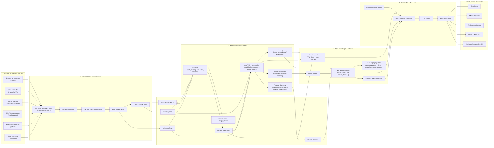
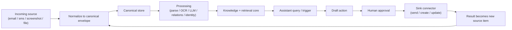
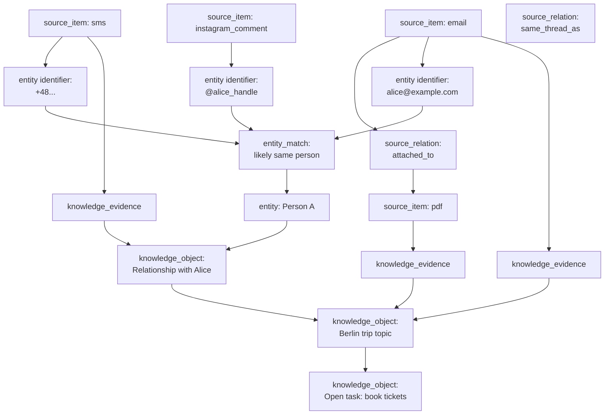
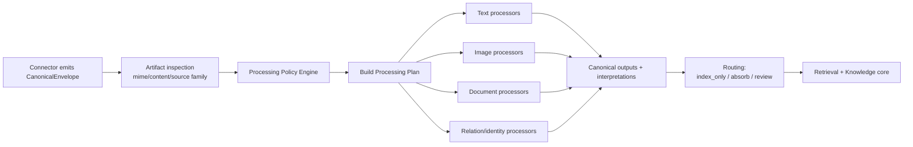

Starannie i dokładnie wyjaśnij mi to:
# LLM Wiki

A pattern for building personal knowledge bases using LLMs.

This is an idea file, it is designed to be copy pasted to your own LLM Agent (e.g. OpenAI Codex, Claude Code, OpenCode / Pi, or etc.). Its goal is to communicate the high level idea, but your agent will build out the specifics in collaboration with you.

## The core idea

Most people's experience with LLMs and documents looks like RAG: you upload a collection of files, the LLM retrieves relevant chunks at query time, and generates an answer. This works, but the LLM is rediscovering knowledge from scratch on every question. There's no accumulation. Ask a subtle question that requires synthesizing five documents, and the LLM has to find and piece together the relevant fragments every time. Nothing is built up. NotebookLM, ChatGPT file uploads, and most RAG systems work this way.

The idea here is different. Instead of just retrieving from raw documents at query time, the LLM **incrementally builds and maintains a persistent wiki** — a structured, interlinked collection of markdown files that sits between you and the raw sources. When you add a new source, the LLM doesn't just index it for later retrieval. It reads it, extracts the key information, and integrates it into the existing wiki — updating entity pages, revising topic summaries, noting where new data contradicts old claims, strengthening or challenging the evolving synthesis. The knowledge is compiled once and then *kept current*, not re-derived on every query.

This is the key difference: **the wiki is a persistent, compounding artifact.** The cross-references are already there. The contradictions have already been flagged. The synthesis already reflects everything you've read. The wiki keeps getting richer with every source you add and every question you ask.

You never (or rarely) write the wiki yourself — the LLM writes and maintains all of it. You're in charge of sourcing, exploration, and asking the right questions. The LLM does all the grunt work — the summarizing, cross-referencing, filing, and bookkeeping that makes a knowledge base actually useful over time. In practice, I have the LLM agent open on one side and Obsidian open on the other. The LLM makes edits based on our conversation, and I browse the results in real time — following links, checking the graph view, reading the updated pages. Obsidian is the IDE; the LLM is the programmer; the wiki is the codebase.

This can apply to a lot of different contexts. A few examples:

- **Personal**: tracking your own goals, health, psychology, self-improvement — filing journal entries, articles, podcast notes, and building up a structured picture of yourself over time.
- **Research**: going deep on a topic over weeks or months — reading papers, articles, reports, and incrementally building a comprehensive wiki with an evolving thesis.
- **Reading a book**: filing each chapter as you go, building out pages for characters, themes, plot threads, and how they connect. By the end you have a rich companion wiki. Think of fan wikis like [Tolkien Gateway](https://tolkiengateway.net/wiki/Main_Page) — thousands of interlinked pages covering characters, places, events, languages, built by a community of volunteers over years. You could build something like that personally as you read, with the LLM doing all the cross-referencing and maintenance.
- **Business/team**: an internal wiki maintained by LLMs, fed by Slack threads, meeting transcripts, project documents, customer calls. Possibly with humans in the loop reviewing updates. The wiki stays current because the LLM does the maintenance that no one on the team wants to do.
- **Competitive analysis, due diligence, trip planning, course notes, hobby deep-dives** — anything where you're accumulating knowledge over time and want it organized rather than scattered.

## Architecture

There are three layers:

**Raw sources** — your curated collection of source documents. Articles, papers, images, data files. These are immutable — the LLM reads from them but never modifies them. This is your source of truth.

**The wiki** — a directory of LLM-generated markdown files. Summaries, entity pages, concept pages, comparisons, an overview, a synthesis. The LLM owns this layer entirely. It creates pages, updates them when new sources arrive, maintains cross-references, and keeps everything consistent. You read it; the LLM writes it.

**The schema** — a document (e.g. CLAUDE.md for Claude Code or AGENTS.md for Codex) that tells the LLM how the wiki is structured, what the conventions are, and what workflows to follow when ingesting sources, answering questions, or maintaining the wiki. This is the key configuration file — it's what makes the LLM a disciplined wiki maintainer rather than a generic chatbot. You and the LLM co-evolve this over time as you figure out what works for your domain.

## Operations

**Ingest.** You drop a new source into the raw collection and tell the LLM to process it. An example flow: the LLM reads the source, discusses key takeaways with you, writes a summary page in the wiki, updates the index, updates relevant entity and concept pages across the wiki, and appends an entry to the log. A single source might touch 10-15 wiki pages. Personally I prefer to ingest sources one at a time and stay involved — I read the summaries, check the updates, and guide the LLM on what to emphasize. But you could also batch-ingest many sources at once with less supervision. It's up to you to develop the workflow that fits your style and document it in the schema for future sessions.

**Query.** You ask questions against the wiki. The LLM searches for relevant pages, reads them, and synthesizes an answer with citations. Answers can take different forms depending on the question — a markdown page, a comparison table, a slide deck (Marp), a chart (matplotlib), a canvas. The important insight: **good answers can be filed back into the wiki as new pages.** A comparison you asked for, an analysis, a connection you discovered — these are valuable and shouldn't disappear into chat history. This way your explorations compound in the knowledge base just like ingested sources do.

**Lint.** Periodically, ask the LLM to health-check the wiki. Look for: contradictions between pages, stale claims that newer sources have superseded, orphan pages with no inbound links, important concepts mentioned but lacking their own page, missing cross-references, data gaps that could be filled with a web search. The LLM is good at suggesting new questions to investigate and new sources to look for. This keeps the wiki healthy as it grows.

## Indexing and logging

Two special files help the LLM (and you) navigate the wiki as it grows. They serve different purposes:

**index.md** is content-oriented. It's a catalog of everything in the wiki — each page listed with a link, a one-line summary, and optionally metadata like date or source count. Organized by category (entities, concepts, sources, etc.). The LLM updates it on every ingest. When answering a query, the LLM reads the index first to find relevant pages, then drills into them. This works surprisingly well at moderate scale (~100 sources, ~hundreds of pages) and avoids the need for embedding-based RAG infrastructure.

**log.md** is chronological. It's an append-only record of what happened and when — ingests, queries, lint passes. A useful tip: if each entry starts with a consistent prefix (e.g. `## [2026-04-02] ingest | Article Title`), the log becomes parseable with simple unix tools — `grep "^## \[" log.md | tail -5` gives you the last 5 entries. The log gives you a timeline of the wiki's evolution and helps the LLM understand what's been done recently.

## Optional: CLI tools

At some point you may want to build small tools that help the LLM operate on the wiki more efficiently. A search engine over the wiki pages is the most obvious one — at small scale the index file is enough, but as the wiki grows you want proper search. [qmd](https://github.com/tobi/qmd) is a good option: it's a local search engine for markdown files with hybrid BM25/vector search and LLM re-ranking, all on-device. It has both a CLI (so the LLM can shell out to it) and an MCP server (so the LLM can use it as a native tool). You could also build something simpler yourself — the LLM can help you vibe-code a naive search script as the need arises.

## Tips and tricks

- **Obsidian Web Clipper** is a browser extension that converts web articles to markdown. Very useful for quickly getting sources into your raw collection.
- **Download images locally.** In Obsidian Settings → Files and links, set "Attachment folder path" to a fixed directory (e.g. `raw/assets/`). Then in Settings → Hotkeys, search for "Download" to find "Download attachments for current file" and bind it to a hotkey (e.g. Ctrl+Shift+D). After clipping an article, hit the hotkey and all images get downloaded to local disk. This is optional but useful — it lets the LLM view and reference images directly instead of relying on URLs that may break. Note that LLMs can't natively read markdown with inline images in one pass — the workaround is to have the LLM read the text first, then view some or all of the referenced images separately to gain additional context. It's a bit clunky but works well enough.
- **Obsidian's graph view** is the best way to see the shape of your wiki — what's connected to what, which pages are hubs, which are orphans.
- **Marp** is a markdown-based slide deck format. Obsidian has a plugin for it. Useful for generating presentations directly from wiki content.
- **Dataview** is an Obsidian plugin that runs queries over page frontmatter. If your LLM adds YAML frontmatter to wiki pages (tags, dates, source counts), Dataview can generate dynamic tables and lists.
- The wiki is just a git repo of markdown files. You get version history, branching, and collaboration for free.

## Why this works

The tedious part of maintaining a knowledge base is not the reading or the thinking — it's the bookkeeping. Updating cross-references, keeping summaries current, noting when new data contradicts old claims, maintaining consistency across dozens of pages. Humans abandon wikis because the maintenance burden grows faster than the value. LLMs don't get bored, don't forget to update a cross-reference, and can touch 15 files in one pass. The wiki stays maintained because the cost of maintenance is near zero.

The human's job is to curate sources, direct the analysis, ask good questions, and think about what it all means. The LLM's job is everything else.

The idea is related in spirit to Vannevar Bush's Memex (1945) — a personal, curated knowledge store with associative trails between documents. Bush's vision was closer to this than to what the web became: private, actively curated, with the connections between documents as valuable as the documents themselves. The part he couldn't solve was who does the maintenance. The LLM handles that.


## Note

This document is intentionally abstract. It describes the idea, not a specific implementation. The exact directory structure, the schema conventions, the page formats, the tooling — all of that will depend on your domain, your preferences, and your LLM of choice. Everything mentioned above is optional and modular — pick what's useful, ignore what isn't. For example: your sources might be text-only, so you don't need image handling at all. Your wiki might be small enough that the index file is all you need, no search engine required. You might not care about slide decks and just want markdown pages. You might want a completely different set of output formats. The right way to use this is to share it with your LLM agent and work together to instantiate a version that fits your needs. The document's only job is to communicate the pattern. Your LLM can figure out the rest.

--
Poniżej rozkładam ten pomysł na części i tłumaczę go tak, żeby było jasne nie tylko **co autor proponuje**, ale też **dlaczego to ma sens**, **czym różni się od zwykłego RAG-a** i **jak to wygląda w praktyce**.

# Co to właściwie jest „LLM Wiki”

To wzorzec budowy **osobistej bazy wiedzy**, w której LLM nie jest tylko „wyszukiwarką odpowiedzi”, ale pełni rolę **stałego redaktora i bibliotekarza**.

Najkrócej:

* masz **surowe źródła**: artykuły, PDF-y, notatki, transkrypcje, obrazy, dane,
* masz **wiki w markdownie**: uporządkowaną sieć stron o pojęciach, osobach, tematach, tezach, porównaniach,
* masz **instrukcję działania dla LLM-a**: jak ma tę wiki utrzymywać.

Kluczowy zwrot myślowy jest taki:

> Zamiast za każdym razem pytać model: „przeczytaj moje dokumenty i wymyśl odpowiedź od zera”, pozwalasz mu **na bieżąco budować trwały, narastający artefakt wiedzy**.

Ten artefakt to właśnie wiki.

---

# Najważniejsza różnica względem RAG

## Jak działa typowy RAG

W klasycznym podejściu:

1. wrzucasz dokumenty,
2. system przy pytaniu znajduje pasujące fragmenty,
3. model z tych fragmentów składa odpowiedź.

To działa dobrze dla prostych pytań i ma tę zaletę, że nie trzeba wcześniej dużo „opracowywać” dokumentów.

Ale ma też ograniczenie:

* model **za każdym razem zaczyna prawie od nowa**,
* musi ponownie znaleźć, zrozumieć i zsyntetyzować wiedzę,
* wcześniejsze odkrycia i połączenia nie utrwalają się jako trwała struktura.

Czyli: odpowiedzi są generowane doraźnie, a nie odkładają się w systemie.

## Jak działa LLM Wiki

Tutaj model nie tylko wyszukuje, ale:

* czyta nowe źródła,
* wyciąga z nich informacje,
* dopisuje je do istniejących stron,
* aktualizuje podsumowania,
* zaznacza sprzeczności,
* wzmacnia albo osłabia wcześniejsze tezy,
* dokłada linki między stronami.

W efekcie po miesiącu pracy nie masz tylko „kolekcji plików do przeszukania”, ale **skomplikowaną, już częściowo przetrawioną mapę wiedzy**.

To jest zasadnicza idea tego dokumentu:
**wiedza ma się kumulować w trwałej formie**.

---

# Dobra metafora: RAG vs LLM Wiki

Wyobraź sobie dwa style pracy.

## RAG

Masz wielki stos papierów.
Za każdym pytaniem asystent biegnie do stosu, przegląda kartki i mówi: „chyba znalazłem odpowiedź”.

## LLM Wiki

Masz wielki stos papierów **plus** porządnie prowadzony notes badacza:

* są osobne strony o ludziach, pojęciach i projektach,
* są odsyłacze,
* są zapisane sprzeczności,
* są aktualne syntezy,
* są dopiski po każdej nowej lekturze.

Tutaj pytania zadajesz głównie temu notesowi, a nie surowemu stosowi papierów.

To dlatego autor pisze, że wiki jest **persistent, compounding artifact** — trwałym artefaktem, który się wzbogaca.

---

# Co znaczy, że wiki jest „kompilowana”

To jest bardzo ważny niuans.

Autor sugeruje myślenie o wiki jak o czymś podobnym do:

* kodu źródłowego i programu,
* surowych danych i przetworzonej reprezentacji,
* dokumentów wejściowych i „warstwy semantycznej”.

Surowe źródła są prawdą bazową.
Wiki jest **warstwą opracowaną**:

* zsyntetyzowaną,
* ustrukturyzowaną,
* wzajemnie połączoną,
* zaktualizowaną po kolejnych źródłach.

Czyli nie odpowiadasz na pytania bezpośrednio z chaosu dokumentów, tylko z czegoś, co model już wcześniej „skompilował” z tego chaosu.

To obniża koszt kolejnych zapytań i poprawia ciągłość myślenia.

---

# Trzy warstwy architektury

Autor wyróżnia trzy warstwy. To bardzo sensowny podział.

## 1. Raw sources — surowe źródła

To wszystko, co dostarczasz:

* artykuły,
* książki,
* PDF-y,
* notatki,
* transkrypcje rozmów,
* obrazy,
* dane.

Najważniejsza zasada:

**LLM ich nie modyfikuje.**

One są niezmienne. To źródło prawdy.
Jeżeli wiki coś źle zinterpretuje, można wrócić do źródła i sprawdzić.

To krytyczne, bo bez tego system staje się samonakręcającą halucynacją.

## 2. The wiki — właściwa baza wiedzy

To katalog plików markdown generowanych przez model.
Tu mogą być:

* strony o osobach,
* strony o pojęciach,
* strony o projektach,
* podsumowania źródeł,
* porównania,
* syntezy tematyczne,
* analizy,
* timeline’y,
* listy pytań otwartych.

To warstwa, którą **czytasz Ty**, ale **pisze ją model**.

## 3. The schema — instrukcja dla modelu

To chyba najbardziej niedoceniony element.

Schema to dokument typu:

* `CLAUDE.md`,
* `AGENTS.md`,
* albo inny plik instrukcyjny,

który mówi modelowi:

* jak wygląda struktura wiki,
* jakie są konwencje nazewnictwa,
* jak tworzyć strony,
* jak aktualizować istniejące treści,
* jak cytować źródła,
* jak oznaczać sprzeczności,
* jak odpowiadać na pytania,
* co robić przy ingest, query i lint.

Bez tego LLM jest po prostu „sprytnym chatbotem”.
Ze schema staje się **zdyscyplinowanym operatorem bazy wiedzy**.

To bardzo trafna obserwacja autora: jakość systemu nie wynika tylko z modelu, ale z **reguł utrzymania wiedzy**.

---

# Dlaczego schema jest aż tak ważna

Bo LLM bez wyraźnych reguł będzie działał niespójnie. Na przykład:

* raz utworzy stronę „OpenAI”, innym razem „OpenAI Inc.”,
* raz zapisze sprzeczność, innym razem ją przemilczy,
* raz zrobi dobrą stronę podsumowującą, a raz dopisze luźną notatkę,
* po czasie wiki stanie się nierówna i trudna do utrzymania.

Schema wymusza stabilność.
To trochę jak:

* styl guide w dokumentacji,
* konwencje w repozytorium kodu,
* schemat bazy danych dla danych strukturalnych.

Tu schema jest „kontraktem operacyjnym” dla modelu.

---

# Trzy główne operacje: ingest, query, lint

To jest praktyczny rdzeń systemu.

## Ingest — dodawanie nowego źródła

Scenariusz jest taki:

1. wrzucasz nowe źródło do katalogu surowych materiałów,
2. prosisz LLM, żeby je przetworzył,
3. model czyta źródło,
4. wyciąga kluczowe informacje,
5. tworzy stronę podsumowującą źródło,
6. aktualizuje odpowiednie strony tematyczne i encje,
7. dopisuje zmiany do indeksu,
8. dodaje wpis do logu.

Czyli jedno źródło nie trafia tylko do „magazynu”. Ono zostaje **wchłonięte do istniejącej wiedzy**.

To jest bardzo ważne: pojedynczy dokument może wpłynąć na 10–15 stron.
To dokładnie to, czego ludzie zwykle nie robią ręcznie, bo jest zbyt pracochłonne.

## Query — zadawanie pytań

W tym modelu pytanie nie jest tylko rozmową z chatbotem.
Pytanie może mieć dwa skutki:

1. dostać odpowiedź na podstawie istniejącej wiki,
2. wytworzyć nową wartościową stronę, którą zapisujesz z powrotem do wiki.

To mocna idea.

Przykład:

* pytasz: „Porównaj stanowiska X i Y wobec problemu Z”.
* model czyta kilka stron wiki,
* robi porównanie,
* a potem zapisuje wynik jako nową stronę: `comparisons/x-vs-y-on-z.md`.

Wtedy analiza nie znika w historii chatu.
Staje się częścią rosnącej bazy wiedzy.

To właśnie autor ma na myśli, mówiąc, że eksploracje też powinny się kumulować.

## Lint — przegląd jakości wiki

To bardzo „software’owy” pomysł i bardzo dobry.

Tak jak kod ma linting, tak wiki może mieć okresowy przegląd jakości:

* czy są sprzeczności między stronami,
* czy stare twierdzenia nie zostały obalone przez nowsze źródła,
* czy są strony-osierocone bez linków,
* czy ważne pojęcia nie mają własnej strony,
* czy linkowanie jest kompletne,
* gdzie są luki informacyjne,
* co warto jeszcze sprawdzić web search’em.

To istotne, bo rosnąca wiki bez konserwacji zaczyna gnić:

* robi się redundantna,
* powstają rozjazdy między stronami,
* stare podsumowania przestają być aktualne,
* nowe źródła nie są wszędzie odzwierciedlone.

Lint ma utrzymywać spójność.

---

# Po co są `index.md` i `log.md`

To są dwa specjalne pliki o różnych rolach.

## `index.md` — mapa treści

To katalog tego, co istnieje w wiki.
Powinien zawierać:

* link do każdej strony,
* krótki opis,
* ewentualnie metadane.

Czyli to nie jest dziennik zmian, tylko **spis zawartości**.

Po co?

Bo model może najpierw przeczytać indeks, a dopiero potem wejść w potrzebne strony.
Przy średniej skali to może zastąpić klasyczny system wyszukiwania embeddingowego.

Innymi słowy:
`index.md` pełni rolę prostego, jawnego systemu nawigacji.

To jest eleganckie, bo:

* jest zrozumiałe dla człowieka,
* jest łatwe do wersjonowania,
* działa bez dodatkowej infrastruktury.

## `log.md` — historia operacji

To dziennik w czasie:

* co dodano,
* kiedy,
* jakie pytania zadano,
* jakie analizy wykonano,
* kiedy był lint,
* co zmieniło się ostatnio.

Czyli:

* `index.md` mówi: **co jest w wiki**
* `log.md` mówi: **co się działo z wiki**

To rozróżnienie jest ważne.

Log przydaje się zarówno Tobie, jak i modelowi, bo pozwala zrozumieć:

* co zostało niedawno przetworzone,
* nad czym już pracowano,
* co jest świeże,
* jakie działania były ostatnie.

Autor zwraca uwagę na ustandaryzowany prefix wpisów logu. To praktyczny detal, ale sensowny: dzięki temu da się log obrabiać prostymi narzędziami tekstowymi.

---

# Dlaczego markdown i Obsidian mają tu sens

Autor świadomie osadza ten pomysł w plikach markdown i w Obsidianie. To nie jest przypadek.

## Markdown

Daje kilka przewag:

* jest prosty,
* czytelny dla człowieka,
* łatwy dla LLM-a,
* dobrze działa w repozytorium git,
* da się przeszukiwać zwykłymi narzędziami,
* linkowanie między plikami jest naturalne.

Markdown jest dobrym „formatem pośrednim” między człowiekiem a modelem.

## Obsidian

Obsidian robi z tego wygodne środowisko pracy, bo daje:

* szybkie przeglądanie plików,
* linki wiki-style,
* graph view,
* pluginy,
* pracę na lokalnych plikach.

Autor mówi:
**Obsidian jest jak IDE, LLM jak programista, a wiki jak codebase.**

To bardzo trafna analogia.

Czyli:

* Ty przeglądasz rezultat,
* model wykonuje edycje,
* a sama baza wiedzy staje się czymś w rodzaju „żywego repozytorium”.

---

# Co oznacza „LLM writes, human curates”

To zdanie dobrze streszcza podział ról.

## Człowiek

Ma robić to, w czym jest dobry:

* wybierać źródła,
* decydować, co jest ważne,
* zadawać pytania,
* oceniać interpretacje,
* prowadzić kierunek badania.

## LLM

Ma robić to, co jest żmudne i powtarzalne:

* streszczać,
* aktualizować wiele plików naraz,
* dopisywać cross-linki,
* pilnować struktury,
* rejestrować zmiany,
* scalać wiedzę.

To sensowny podział.
Ludzie zwykle porzucają wiki nie dlatego, że nie chcą myśleć, tylko dlatego, że nie chcą robić mechanicznej konserwacji.

Autor twierdzi, że właśnie tę barierę usuwa LLM.

---

# W jakich zastosowaniach to ma największy sens

Dokument podaje kilka przykładów, ale można je uogólnić.

Ten wzorzec działa najlepiej tam, gdzie:

* wiedza narasta w czasie,
* źródeł jest dużo,
* między źródłami są relacje,
* warto utrwalać syntezy,
* wracasz do tematu wielokrotnie.

## Szczególnie dobre przypadki

### 1. Research / deep dive

Gdy przez tygodnie czytasz o jednym temacie.
Tutaj największy problem to nie brak odpowiedzi, tylko nadmiar rozproszonych notatek.
LLM Wiki rozwiązuje dokładnie ten problem.

### 2. Osobista baza wiedzy

Dzienniki, zdrowie, produktywność, psychologia, cele.
Można budować stronę o sobie samym: wzorce, wnioski, hipotezy, interwencje, obserwacje w czasie.

### 3. Książki / fikcja / światy

Bardzo sensowny przypadek.
Postacie, miejsca, wątki, motywy, timeline, relacje.
To prawie naturalny format wiki.

### 4. Wiedza zespołowa / firmowa

Spotkania, Slack, decyzje, projekty, feedback klientów.
Tu największą wartością jest to, że ktoś wreszcie utrzymuje porządek.
I tym „kimś” ma być model.

### 5. Due diligence, analiza konkurencji, podróże, kursy

Wszystkie sytuacje, gdzie istnieje ciągła kumulacja materiału i późniejsze pytania wielokrotnego użytku.

---

# Dlaczego ten pomysł jest mocny intelektualnie

Bo nie traktuje LLM-a tylko jako generatora odpowiedzi, ale jako **silnik utrzymania pamięci zewnętrznej**.

To jest dużo dojrzalsze użycie modeli niż proste „zadaj pytanie i zobacz, co wyjdzie”.

W gruncie rzeczy autor proponuje:

* pamięć długoterminową poza kontekstem okna modelu,
* jawne struktury wiedzy,
* iteracyjne aktualizowanie syntezy,
* utrwalanie wniosków z rozmów,
* kontrolę przez źródła pierwotne.

Czyli to jest próba zbudowania **systemu poznawczego**, a nie tylko chatbota z plikami.

---

# Najważniejsze zalety tego podejścia

## 1. Wiedza się kumuluje

To główna przewaga.
Każde nowe źródło wzbogaca cały system, a nie tylko zwiększa pulę dokumentów do przyszłego przeszukiwania.

## 2. Lepiej działa synteza wieloźródłowa

Jeśli coś wymaga połączenia pięciu artykułów i dwóch rozmów, to wiki może już mieć takie połączenia utrwalone.

## 3. Mniej powtarzania tej samej pracy

Model nie musi za każdym razem odkrywać od nowa tych samych zależności.

## 4. Lepsza nawigacja dla człowieka

Człowiek może przeglądać efekty w formie zrozumiałych stron, nie tylko polegać na odpowiedziach w chacie.

## 5. Trwalsze wyniki rozmów

Wnioski z pytań i analiz nie znikają w historii chatu.

## 6. Niski koszt aktualizacji wielu plików

To dokładnie ten obszar, gdzie LLM jest praktycznie idealny.

---

# Ograniczenia i ryzyka

To nie jest magiczne rozwiązanie. Ma też słabe strony.

## 1. Ryzyko dryfu i nadpisania sensu

Jeśli model źle zrozumie źródło i wpisze błędną interpretację do wiki, błąd może się rozlać na wiele stron.

Dlatego ważne są:

* niezmienne źródła,
* cytowania,
* możliwość audytu,
* kontrola człowieka.

## 2. Utrzymanie spójności robi się trudniejsze wraz ze skalą

Im większa wiki, tym większe ryzyko:

* duplikatów,
* rozjechanych nazw,
* powielonych tez,
* lokalnych sprzeczności.

Stąd potrzeba lint i dobrego schema.

## 3. Model może „zbyt pewnie” syntetyzować

Przy syntezie z natury pojawia się interpretacja.
Interpretacja bywa cenna, ale może być zbyt śmiała.

Dlatego dobrze rozdzielać w stronach:

* fakty ze źródeł,
* interpretacje,
* hipotezy,
* otwarte pytania.

## 4. To wymaga dyscypliny projektowej

Nie infrastruktury klasy enterprise, ale jednak dyscypliny:

* sensowne nazewnictwo,
* stały workflow,
* jasne zasady aktualizacji,
* log i indeks,
* okresowa kontrola.

## 5. Nie zawsze lepsze od prostego RAG

Jeśli masz:

* mało dokumentów,
* rzadkie pytania,
* brak potrzeby długoterminowej kumulacji,

to taki system może być przesadą.

---

# Kiedy to ma sens, a kiedy nie

## Ma sens, gdy:

* wracasz do tematu wiele razy,
* budujesz wiedzę przez tygodnie lub miesiące,
* zależy Ci na strukturze i trwałości,
* często robisz syntezę z wielu źródeł,
* chcesz przeglądać wiedzę poza czatem.

## Mniejszy sens, gdy:

* robisz jednorazowe pytania,
* masz kilka dokumentów,
* nie chcesz utrzymywać żadnej struktury,
* wystarcza Ci jednorazowe Q&A,
* temat jest krótki i zamknięty.

Czyli to nie jest „zamiennik każdego RAG-a”, tylko wzorzec dla sytuacji, gdzie wiedza ma charakter **rosnącego projektu**.

---

# Co naprawdę jest tu nowatorskie

Nie pojedyncze elementy z osobna, bo:

* wiki istnieją od dawna,
* RAG istnieje,
* Obsidian istnieje,
* markdown istnieje,
* LLM-y robią streszczenia.

Nowe jest **połączenie tych elementów w jeden operacyjny wzorzec**:

1. źródła pozostają surowe i niezmienne,
2. wiki jest warstwą pośrednią, narastającą i utrzymywaną przez model,
3. pytania też mogą tworzyć nowe trwałe strony,
4. schema steruje zachowaniem modelu jak regulamin pracy redaktora,
5. lint traktuje bazę wiedzy jak utrzymywalny system.

To jest bardzo „software-engineeringowe” podejście do wiedzy.

---

# Co oznacza odniesienie do Memexu

Autor przywołuje Memex Vannevara Busha z 1945 roku. Sens tego odniesienia jest taki:

Bush wyobrażał sobie prywatny system wiedzy, gdzie ważne są nie tylko dokumenty, ale też **powiązania między nimi**.

Web ostatecznie poszedł raczej w stronę:

* masowej publikacji,
* rozproszonych stron,
* publicznych linków.

A tutaj wracamy do wizji bardziej:

* osobistej,
* kuratorskiej,
* prywatnej,
* z naciskiem na asocjacyjne ścieżki między ideami.

Autor mówi w istocie:
„Bush miał rację co do formy, ale brakowało mu taniego mechanizmu utrzymania. LLM wypełnia tę lukę”.

To jest filozoficzny fundament tego pomysłu.

---

# Jak to wyglądałoby w praktyce na prostym przykładzie

Załóżmy, że robisz deep dive o śnie i produktywności.

## Surowe źródła

Masz:

* artykuły naukowe,
* podcasty,
* własne notatki dzienne,
* dane z zegarka,
* kilka książek.

## Wiki

Model tworzy strony takie jak:

* `concepts/sleep-debt.md`
* `concepts/circadian-rhythm.md`
* `entities/matthew-walker.md`
* `personal/my-sleep-patterns.md`
* `comparisons/caffeine-vs-nap.md`
* `sources/2026-04-04-article-xyz.md`
* `synthesis/sleep-and-focus.md`

## Ingest

Dodajesz nowy artykuł o wpływie światła porannego.
LLM:

* tworzy jego streszczenie,
* aktualizuje stronę o rytmie dobowym,
* dopisuje wzmiankę na stronie o Twoich nawykach,
* oznacza, że nowy artykuł wzmacnia wcześniejszą hipotezę,
* dopisuje wszystko do indeksu i logu.

## Query

Pytasz:
„Czy moje spadki energii po południu bardziej pasują do problemu ze snem, kofeiną czy pory obiadu?”

LLM nie przeszukuje już chaotycznie wszystkiego, tylko:

* czyta odpowiednie strony wiki,
* porównuje istniejące hipotezy,
* odpowiada,
* a potem może zapisać wynik jako stronę:
  `analysis/afternoon-energy-dip-hypotheses.md`.

To dobrze pokazuje, jak eksploracja staje się trwałym aktywem.

---

# Po co opcjonalne narzędzia CLI

Autor mówi: na początku nie potrzebujesz wiele.
To ważne — ten system nie ma być od razu wielką platformą.

Ale gdy wiki urośnie, mogą się przydać narzędzia, np. wyszukiwarka po markdownie.

To jest sensowna ewolucja:

## Mała skala

Wystarczy:

* katalog plików,
* `index.md`,
* `log.md`,
* sensowne nazwy stron.

## Większa skala

Dochodzi:

* pełnotekstowe wyszukiwanie,
* ranking trafności,
* może wyszukiwanie hybrydowe,
* może narzędzie MCP,
* może skrypty do lintu.

Czyli autor nie sprzedaje ciężkiej infrastruktury od początku.
Proponuje wzorzec, który rośnie wraz z potrzebą.

---

# Dlaczego autor tak mocno podkreśla, że dokument jest abstrakcyjny

Bo to nie jest gotowy produkt ani ścisły standard.
To jest raczej **meta-wzorzec**.

Znaczy to:

* nie ma jednej poprawnej struktury katalogów,
* nie ma jednego poprawnego schematu stron,
* nie ma jednego poprawnego workflow,
* nie ma jednej poprawnej integracji z konkretnym modelem.

To zależy od domeny.

Inaczej zbudujesz wiki do:

* medycyny osobistej,
* czytania powieści,
* pracy badawczej,
* wiedzy projektowej w firmie.

Czyli ten tekst nie jest instrukcją „zrób dokładnie tak”, tylko propozycją:
**„to jest dobry sposób myślenia; dopasuj implementację do swoich potrzeb”**.

---

# Co ten dokument zakłada nie wprost

Są tu też ważne założenia ukryte między wierszami.

## 1. LLM ma dostęp do plików i może je edytować

To nie jest zwykły chatbot w przeglądarce bez pamięci.
To raczej agent pracujący na repozytorium plików.

## 2. Człowiek jednak pozostaje recenzentem

Choć autor mówi „LLM writes the wiki”, to nie znaczy „ufaj bezgranicznie”.
Rola człowieka w selekcji i nadzorze jest nadal krytyczna.

## 3. Ważna jest jawność struktury

To nie ma być „tajemna pamięć modelu”, tylko czytelna sieć plików, którą możesz sam otworzyć.

## 4. Wiedza ma być przeglądalna poza czatem

To odróżnia ten model od wielu systemów conversational AI.
Tutaj efekt pracy ma istnieć niezależnie od konkretnej sesji.

---

# Gdzie leży największa wartość praktyczna

Moim zdaniem w trzech miejscach.

## Po pierwsze: trwała synteza

Największy problem przy dużej liczbie materiałów to nie brak dostępu, tylko brak trwałych syntez.
Ten system dokładnie to adresuje.

## Po drugie: konserwacja relacji

Linki, sprzeczności, aktualizacje, przejścia między poziomami abstrakcji — człowiek robi to źle i nieregularnie, model może robić to systematycznie.

## Po trzecie: zamiana rozmów w aktywa

W normalnym chatowym workflow dobre pytania i dobre odpowiedzi przepadają.
Tutaj mają trafiać z powrotem do wiedzy bazowej.

To bardzo ważne i często niedoceniane.

---

# Jednozdaniowe streszczenie całej idei

To propozycja, żeby używać LLM-a nie jako jednorazowego odpowiadacza na pytania nad stertą dokumentów, lecz jako **stałego redaktora osobistej wiki**, która z każdą nową lekturą i każdym sensownym pytaniem staje się bogatsza, bardziej uporządkowana i bardziej użyteczna.

---

# Najkrótsza wersja „co autor chce powiedzieć”

Autor mówi mniej więcej to:

> Nie każ modelowi za każdym razem na nowo przeszukiwać chaosu dokumentów.
> Pozwól mu z tego chaosu budować uporządkowaną, trwałą wiki, którą będzie stale utrzymywał i rozwijał.
> Wtedy wiedza się akumuluje, a nie odtwarza od zera.

---

# Moja ocena tego pomysłu

To jest **bardzo dobry wzorzec** dla pracy długoterminowej z wiedzą.
Nie dlatego, że eliminuje wszystkie problemy, ale dlatego, że trafnie identyfikuje prawdziwe wąskie gardło: **utrzymanie i integrację wiedzy w czasie**.

Najmocniejsze elementy tego pomysłu to:

* rozdzielenie źródeł i opracowanej warstwy wiki,
* traktowanie wiki jako trwałego artefaktu,
* schema jako instrukcji operacyjnej,
* query-results-as-pages,
* lint jako konserwacja spójności.

Najsłabszy punkt to ryzyko, że bez dobrej dyscypliny i audytu model zacznie produkować pozornie uporządkowaną, ale częściowo błędną nadbudowę.
Czyli pomysł jest mocny, ale wymaga dobrych praktyk.

---

# Gdybym miał to przełożyć na jedno praktyczne zalecenie

Jeśli ktoś chce to wdrożyć, powinien myśleć tak:

1. **nie zaczynaj od skomplikowanej infrastruktury**,
2. **zacznij od prostych plików markdown**,
3. **ustal dobre zasady w schema**,
4. **dbaj o cytowania i odwołania do źródeł**,
5. **regularnie rób lint**,
6. **zapisuj wartościowe odpowiedzi z powrotem do wiki**.

To jest sedno.

----
Jak się ten pomysł ma do NotebookLM?
--
Najkrócej: **NotebookLM jest najbliższym gotowym produktem do tej idei, ale nie jest tym samym**.
To raczej **„AI notebook nad zbiorem źródeł”** niż **„LLM-utrzymywana, trwała wiki jako repozytorium wiedzy”**. NotebookLM bardzo dobrze pokrywa część workflowu: dodawanie źródeł, grounded chat z cytatami, generowanie notatek i różnych form opracowania. Natomiast opisane w „LLM Wiki” centrum ciężkości leży gdzie indziej: w **jawnej, plikowej, interlinkowanej, stale utrzymywanej warstwie wiedzy**, którą model edytuje jak codebase. ([Google Pomoc][1])

## Gdzie są podobne

NotebookLM już dziś robi kilka rzeczy bardzo zbieżnych z tym wzorcem:

* działa na **źródłach dostarczonych przez użytkownika** i odpowiada na ich podstawie z cytatami; Google opisuje go jako research assistant oparty na Twoich materiałach, a nie ogólny chatbot. ([Google Pomoc][1])
* ma workflow **source → chat → note**: możesz zapisać odpowiedź do notatki, tworzyć własne notatki, a nawet **zamieniać notatki w źródła**. To jest już zalążek idei „wynik zapytania staje się trwałym artefaktem”. ([Google Pomoc][2])
* coraz lepiej wspiera **pozyskiwanie źródeł**: ma Discover Sources / Search for Sources, a od listopada 2025 także Deep Research wbudowane bezpośrednio w NotebookLM, z możliwością dodania raportu i źródeł do notebooka. ([Google Pomoc][3])
* jest mocny w **transformacjach prezentacyjnych**: Audio Overviews, Video Overviews, flashcards, quizzes, infographics, slide decks, mind maps. ([Google Pomoc][4])

Czyli pod względem **„czytaj źródła, pomagaj myśleć, zapisuj część wyników”** NotebookLM jest bardzo blisko.

## Gdzie różnica jest zasadnicza

Tu zaczyna się prawdziwa rozbieżność.

### 1. NotebookLM jest notebook-centric, a LLM Wiki jest repo-centric

W NotebookLM podstawową jednostką jest **notebook**. Google wprost pisze, że każdy notebook jest niezależny i NotebookLM **nie ma dostępu do wielu notebooków naraz**. W „LLM Wiki” podstawową jednostką jest natomiast **całe repozytorium wiedzy**: wspólna sieć stron, indeksów, logów i konwencji. ([Google Pomoc][5])

To ma duże skutki praktyczne. W NotebookLM wiedza jest dość naturalnie **segmentowana per projekt**. W LLM Wiki celem jest często odwrotnie: żeby nowy materiał aktualizował wspólne strony encji, pojęć i syntez w jednym długowiecznym systemie. To jest wniosek z architektury produktu NotebookLM i z opisu wzorca, a nie deklaracja Google. ([Google Pomoc][5])

### 2. NotebookLM nie jest „jawnie plikową wiki”

W opisie LLM Wiki centralny artefakt to **katalog markdownów**, który możesz przeglądać w Obsidianie, wersjonować w Git, linkować jak wiki i audytować plik po pliku. W oficjalnym opisie NotebookLM widać raczej model: źródła + chat + notes + studio outputs. Nie widać tam pierwszoplanowej, lokalnej, interlinkowanej warstwy markdownowej, którą model stale utrzymuje jako własny produkt pracy. To jest znowu wniosek porównawczy, oparty na tym, jak Google opisuje strukturę NotebookLM. ([Google Pomoc][1])

### 3. NotebookLM zapisuje trwałe elementy, ale nie wygląda na system „wiki maintenance”

NotebookLM pozwala tworzyć do 1000 notatek na notebook, zapisywać odpowiedzi i konwertować notatki do źródeł, ale notatki są używane w promptach **tylko wtedy, gdy je wybierzesz**, podczas gdy źródła są używane zawsze lub jako wybrany podzbiór. To sugeruje model pracy bliższy „notebookowi badawczemu” niż „samoutrzymującej się wiki z warstwą syntezy jako domyślnym punktem wejścia”. ([Google Pomoc][2])

### 4. W LLM Wiki ogromne znaczenie ma schema; w NotebookLM mniej widać „programowalnego maintenera”

Wzorzec LLM Wiki zakłada osobny dokument typu `AGENTS.md` / `CLAUDE.md`, który reguluje styl aktualizacji, naming, typy stron, logowanie ingestów, obsługę sprzeczności, lint itd. NotebookLM ma coraz więcej sterowania chatem — np. custom goals i większą pamięć rozmowy — ale to nie jest to samo, co jawny, repozytoryjny „operating manual” dla utrzymania wiki. ([blog.google][6])

## Co NotebookLM robi lepiej niż „czyste LLM Wiki”

W kilku rzeczach NotebookLM może być wygodniejszy:

* jest **gotowym produktem**, więc nie musisz budować własnego workflow od zera; ([Google Pomoc][1])
* ma bardzo dobre **formy wynikowe do konsumpcji**: audio, video, flashcards, slide decks itd.; ([Google Pomoc][4])
* ma wbudowane **pozyskiwanie źródeł z webu** i Deep Research, co zmniejsza tarcie wejścia. ([Google Pomoc][3])

Czyli NotebookLM jest dziś mocniejszy jako **produkt do pracy nad materiałem** niż jako **silnik długowiecznej, jawnie utrzymywanej bazy wiedzy**.

## Co LLM Wiki robi lepiej niż NotebookLM

Jeśli dobrze to wdrożysz, LLM Wiki ma przewagę tam, gdzie liczy się:

* **pełna własność artefaktu**: zwykłe pliki markdown w Twoim repo,
* **jawna struktura wiedzy**: strony encji, pojęć, syntez, porównań, indeksów, logów,
* **interlinking jako obywatel pierwszej klasy**,
* **długoterminowa kumulacja** w jednym systemie, zamiast w osobnych notebookach,
* **programowalny workflow utrzymania** przez schema,
* **łatwość audytu i version control**.

To są głównie konsekwencje architektury opisanej w „LLM Wiki”, w kontraście do notebookowego modelu NotebookLM. ([Google Pomoc][5])

## Najtrafniejsza analogia

Powiedziałbym tak:

* **NotebookLM** = inteligentny **warsztat badawczy / notebook roboczy**
* **LLM Wiki** = inteligentnie utrzymywane **repozytorium wiedzy**

NotebookLM pomaga Ci **pracować na materiale**.
LLM Wiki ma docelowo sprawić, że z tej pracy powstaje **trwała, przeglądalna i stale aktualizowana mapa wiedzy**. ([Google Pomoc][1])

## Czy NotebookLM może być częścią takiego systemu?

Tak — i to chyba najlepszy sposób myślenia.

Najsensowniejszy układ to często nie „NotebookLM albo LLM Wiki”, tylko:

* **NotebookLM** do szybkiego czytania źródeł, zadawania pytań, generowania notatek i materiałów pomocniczych,
* **LLM Wiki** jako docelowa, trwała warstwa pamięci i syntezy.

W takim układzie NotebookLM byłby dobrym **front-endem badawczym**, a wiki — **back-endem wiedzy**. To już jest moja rekomendacja architektoniczna, oparta na cechach obu podejść. ([Google Pomoc][1])

## Mój werdykt

**NotebookLM jest bliskim kuzynem tego pomysłu, ale nie jego pełną realizacją.**
Najbliżej mu do części: **ingest + grounded query + notatki + transformacje**.
Najdalej mu do części: **jawna, plikowa, interlinkowana, długowieczna wiki utrzymywana według własnego schematu i workflowu**. ([Google Pomoc][1])


[1]: https://support.google.com/notebooklm/answer/16164461?co=GENIE.Platform%3DDesktop&hl=en "Learn about NotebookLM - Computer - NotebookLM Help"
[2]: https://support.google.com/notebooklm/answer/16262519?hl=en "Create & add notes in NotebookLM - NotebookLM Help"
[3]: https://support.google.com/notebooklm/answer/16215270?co=GENIE.Platform%3DDesktop&hl=en "Add or discover new sources for your notebook - Computer - NotebookLM Help"
[4]: https://support.google.com/notebooklm/?hl=en "NotebookLM Help"
[5]: https://support.google.com/notebooklm/answer/16206563?hl=en "Create a notebook in NotebookLM - NotebookLM Help"
[6]: https://blog.google/innovation-and-ai/models-and-research/google-labs/notebooklm-custom-personas-engine-upgrade/ "NotebookLM adds custom goals, upgrades performance"

----
Dołączyłem do tej rozmowy moje repozytorium z gita snaptag. Jak mój pomysł, snaptag, przeformuuować w narzędzie, opisane powyżej, „LLM Wiki”
--
Tak bym to przeformułował:

## Rdzeń zmiany

**Snaptag nie powinien być opisywany głównie jako „system wyszukiwania po screenshotach”.**
W modelu „LLM Wiki” powinien być opisany jako:

> **lokalny silnik zamieniający strumień screenshotów w utrzymywaną przez LLM osobistą wiki wiedzy i pamięci operacyjnej.**

To jest istotna zmiana.

Dziś, z tego co masz w repo, `snaptag` jest backendem typu:

* ingest screenshotu,
* OCR i ekstrakcja,
* indeks FTS,
* wyszukiwanie,
* opcjonalne sugestie akcji,

czyli dokładnie **ingest → OCR → index → search** z SQLite jako canonical state i FTS jako derived state, zgodnie z [README](https://github.com/hipotures/snaptag/blob/main/README.md), [design spec](https://github.com/hipotures/snaptag/blob/main/docs/superpowers/specs/2026-04-01-snapgit-backend-design.md) i [ADR o canonical vs derived](https://github.com/hipotures/snaptag/blob/main/docs/adr/0001-canonical-vs-derived-state.md).

W wersji „LLM Wiki” to nie wystarcza. Trzeba dołożyć **trwałą warstwę wiedzy**, a nie tylko warstwę retrieval.

---

## Najprostsze przeformułowanie produktu

### Dziś

**SnapTag = local-first screenshot memory system**

### Po przeformułowaniu

**SnapTag = local-first screenshot-to-wiki compiler**

albo bardziej po ludzku:

> SnapTag zbiera screenshoty, traktuje je jako surowe źródła, wyciąga z nich fakty i kontekst, a następnie utrzymuje stale aktualizowaną osobistą wiki: o ludziach, projektach, rozmowach, taskach, decyzjach, planach i wzorcach w czasie.

To jest dokładnie duch „LLM Wiki”.

---

## Jak to mapuje się na Twoją obecną architekturę

To akurat jest mocny punkt: **Twoje repo jest już bardzo blisko dobrego fundamentu**.

Masz już sensowne rozróżnienie między stanem kanonicznym i pochodnym. W [ADR](https://github.com/hipotures/snaptag/blob/main/docs/adr/0001-canonical-vs-derived-state.md) canonical state to tabele relacyjne, a FTS to derived state. To bardzo dobrze pasuje do wzorca LLM Wiki.

### Mapa warstw

| Wzorzec LLM Wiki | Snaptag dziś                        | Snaptag po zmianie                                                  |
| ---------------- | ----------------------------------- | ------------------------------------------------------------------- |
| Raw sources      | screenshoty / blobs / assets        | bez zmian                                                           |
| Wiki             | brak właściwej trwałej warstwy wiki | katalog markdownów utrzymywanych przez LLM                          |
| Schema           | częściowo specs / plans / ADR       | osobny `AGENTS.md` lub `CLAUDE.md` opisujący reguły utrzymania wiki |
| Retrieval        | FTS po OCR                          | FTS po assetach + wyszukiwanie po wiki                              |
| Query output     | odpowiedź / search result           | odpowiedź + opcjonalny nowy wpis do wiki                            |
| Maintenance      | reindex                             | reindex + lint wiki                                                 |

Najważniejsza obserwacja:

> **Nie wyrzucasz obecnej architektury.**
> Dokładasz nad nią nową warstwę: **persistent wiki as derived knowledge layer**.

Czyli:

* `blobs`, `assets`, `pipeline_runs`, `stage_results`, OCR blocks, entities zostają,
* FTS zostaje,
* ale pojawia się **drugi derived layer**: wiki.

FTS służy wtedy do odnajdywania dowodów.
Wiki służy do utrwalania wiedzy.

---

## Co naprawdę trzeba zmienić koncepcyjnie

### 1. Screenshot przestaje być tylko obiektem do wyszukania

Zamiast pytać:

* „znajdź screenshot z tym tekstem”

zaczynasz pytać:

* „co wiem już o tej rozmowie?”
* „jak ten screenshot aktualizuje mój obraz projektu?”
* „czy to jest nowy task, nowa osoba, nowa decyzja, czy tylko kolejny dowód?”
* „na które strony wiki to powinno wpłynąć?”

To przesuwa produkt z **search engine** w stronę **knowledge maintenance system**.

### 2. OCR nie jest celem, tylko etapem kompilacji wiedzy

Dziś OCR jest jednym z głównych wyjść.
Po zmianie OCR staje się tylko jednym z wejść do syntezy.

Nowy łańcuch wyglądałby mniej więcej tak:

`ingest screenshot -> OCR/layout/vision -> extract entities/events/tasks -> create source note -> update wiki pages -> relink/index/log`

### 3. Wyszukiwanie staje się wtórne wobec wiki

W modelu LLM Wiki pytanie nie powinno zaczynać się od „przeszukaj wszystkie screenshoty”, tylko od:

1. przeszukaj wiki,
2. jeśli trzeba, cofnij się do source notes,
3. jeśli dalej trzeba, cofnij się do surowych assetów i OCR.

Czyli kolejność to:

**wiki first, evidence second, raw assets third**

To bardzo ważne.

---

## Jak powinieneś opisać trzy warstwy w Snaptag

Dla Snaptag zrobiłbym nieco bogatszą wersję niż w ogólnym LLM Wiki.

## 1. Raw evidence layer

To, co masz teraz:

* `blobs`
* `assets`
* screenshot files
* metadata czasu/capture
* OCR blocks
* vision outputs
* extracted entities
* action suggestions

To jest Twoje źródło prawdy operacyjnej.

### Zasada

LLM **nigdy nie zmienia** raw assets.

---

## 2. Canonical extracted state

To warstwa pośrednia, której w zwykłym LLM Wiki często nie ma tak jawnie, ale u Ciebie powinna zostać, bo screenshoty są trudniejsze niż zwykłe dokumenty.

Tu należą:

* OCR block tables,
* entity tables,
* possibly normalized events,
* task candidates,
* app/context classification,
* provenance.

To daje Ci audytowalny pomost między obrazem a wiki.

To jest dobra cecha Snaptag — nie gubisz drogi „jak model do tego doszedł”.

---

## 3. Persistent wiki layer

To nowa rzecz.

Tu pojawiają się pliki markdown, np.:

* `wiki/index.md`
* `wiki/log.md`
* `wiki/days/2026-04-04.md`
* `wiki/people/alice.md`
* `wiki/projects/snaptag.md`
* `wiki/apps/telegram.md`
* `wiki/conversations/alice-trip-to-berlin.md`
* `wiki/tasks/book-dermatologist.md`
* `wiki/topics/sleep-issues.md`
* `wiki/sources/screenshots/2026/2026-04-04-asset-1842.md`

To ma być przeglądalne jak Obsidian vault albo zwykłe repo markdownów.

---

## 4. Schema / agent contract

Tu dodajesz `AGENTS.md` albo `CLAUDE.md`, który mówi agentowi:

* jakie są typy stron,
* kiedy aktualizować istniejącą stronę, a kiedy tworzyć nową,
* jak cytować assety,
* jak odróżniać obserwację od inferencji,
* jak zapisywać niepewność,
* jak prowadzić index i log,
* jak robić lint,
* jak odpowiadać na pytania i kiedy zapisywać wynik jako nową stronę.

To będzie operacyjny rdzeń całego systemu.

---

## Jakie typy stron wiki pasują do screenshotów

W ogólnym LLM Wiki są byty, pojęcia i źródła.
U Ciebie screenshoty są bardzo temporalne i fragmentaryczne, więc trzeba dodać typy stron, które to uwzględniają.

## Najważniejsze typy stron dla Snaptag

### `days/`

Dzienne strony agregujące, co się działo danego dnia.

Screenshoty są z natury strumieniem czasu, więc to powinien być jeden z głównych entrypointów.

### `people/`

Osoby pojawiające się w rozmowach, mailach, komunikatorach, kalendarzu, płatnościach.

### `projects/`

Tematy długoterminowe, np. `snaptag`, `trip-to-japan`, `job-search`, `taxes-2026`.

### `conversations/`

Jeśli z wielu screenshotów wynika jeden ciąg rozmowy lub sprawy.

### `tasks/`

Wydzielone zobowiązania, follow-upy, rzeczy do zrobienia.

### `apps/`

Pomocne przy klasyfikacji kontekstu: Telegram, Gmail, X, bank, kalendarz, maps.

### `topics/`

Rzeczy długoterminowe, które nie są projektem ani osobą: zdrowie, finanse, podróże, nauka.

### `sources/screenshots/`

Strona źródłowa per screenshot albo per mały batch, z OCR, krótkim opisem, wykrytymi encjami i linkami do stron docelowych.

To jest odpowiednik „summary page” z ogólnego LLM Wiki.

---

## Jak powinien wyglądać ingest po zmianie

Dziś masz ingest assetu.
Po zmianie ingest powinien mieć **dwie fazy**.

## Faza A: canonical extraction

To, co już w dużej mierze robisz:

* zapis blob/asset,
* OCR,
* ekstrakcja encji,
* klasyfikacja,
* indeks.

## Faza B: wiki integration

Nowy etap:

1. utwórz `source note` dla screenshotu,
2. ustal, które strony wiki są dotknięte,
3. zaktualizuj je,
4. dodaj lub popraw linki,
5. dopisz wpis do `log.md`,
6. zaktualizuj `index.md`.

Czyli jeden screenshot nie kończy życia jako „rekord do wyszukania”.
On staje się nowym dowodem, który aktualizuje istniejącą pamięć.

---

## Jak powinno wyglądać query po zmianie

W LLM Wiki pytania są częścią budowy wiedzy.

Dla Snaptag oznacza to:

### Stary model

User: „znajdź mi screenshot z hasłem X”

### Nowy model

User: „co się dzieje ostatnio w sprawie mieszkania?”
Agent:

* czyta `projects/apartment.md`
* czyta `days/` z ostatnich dni
* ewentualnie podpina nowe `source notes`
* odpowiada
* opcjonalnie tworzy nową stronę `analysis/apartment-current-status.md`

W praktyce odpowiedzi nie powinny znikać w czacie, jeśli są trwałe i użyteczne.

---

## Najważniejsza adaptacja: screenshoty to nie dokumenty

To jest punkt, którego nie wolno zgubić.

LLM Wiki dla PDF-ów i artykułów zakłada, że źródło jest dość spójne.
Screenshoty takie nie są. Są:

* krótkie,
* urwane,
* częściowo redundantne,
* mocno osadzone w czasie,
* często niepełne,
* zależne od kontekstu aplikacji.

Dlatego Snaptag jako LLM Wiki powinien być bardziej:

* **event-centric**
* **timeline-centric**
* **entity-centric**

niż document-centric.

Inaczej mówiąc:

> Twoją podstawową jednostką wiedzy nie jest „dokument”, tylko „mikro-dowód z interfejsu użytkownika”.

To zmienia strukturę wiki.

---

## Jak bym przeformułował misję produktu

Twoja obecna formuła z README jest dobra jako baza, ale dla modelu LLM Wiki przepisałbym ją tak:

> SnapTag to lokalny, jednoosobowy system budowania pamięci z screenshotów.
> Screenshoty są surowym materiałem dowodowym.
> Backend wyciąga z nich tekst, encje, zdarzenia i kontekst, a agent LLM utrzymuje nad tym trwałą, interlinkowaną wiki wiedzy: o osobach, projektach, rozmowach, zadaniach, decyzjach i wzorcach w czasie.
> Wyszukiwanie służy do znajdowania dowodów; wiki służy do kumulowania zrozumienia.

To jest, moim zdaniem, właściwe przeformułowanie.

---

## Co konkretnie dodać do architektury

## 1. Nowy moduł: `wiki`

W specu masz dziś moduły typu `ocr`, `vision`, `enrichment`, `index`, `search`, `actions`.
Dołóż:

* `wiki/`

  * `service.py`
  * `page_resolver.py`
  * `patcher.py`
  * `linker.py`
  * `lint.py`
  * `query_writer.py`

Rola:

* generowanie source notes,
* wybór stron do aktualizacji,
* patchowanie markdownów,
* utrzymywanie `index.md` i `log.md`,
* lint.

## 2. Nowy derived artifact

W [ADR](https://github.com/hipotures/snaptag/blob/main/docs/adr/0001-canonical-vs-derived-state.md) masz FTS jako derived state.
Dodałbym:

* `wiki/` jako drugi derived state,
* ale **persistent and human-readable**.

Czyli:

* FTS = derived retrieval projection
* wiki = derived knowledge projection

To bardzo czyste architektonicznie.

## 3. Nowy etap pipeline

Do obecnego baseline:

`ingest -> ocr -> index`

docelowo dołóż:

`-> source_note -> wiki_update -> wiki_index -> wiki_lint`

Nie wszystkie muszą być gating.
Ja bym zrobił tak:

* `ocr` i `index` nadal gating dla searchable baseline,
* `wiki_update` początkowo non-gating,
* potem, jeśli system się sprawdzi, można go traktować jako główny produkt.

## 4. Nowe operacje API / CLI

Dodałbym:

* `POST /wiki/ingest/{asset_id}`
* `POST /wiki/query`
* `POST /wiki/lint`
* `POST /wiki/rebuild`
* `GET /wiki/page/{slug}`

albo najpierw jako CLI:

* `snaptag wiki ingest-asset 1842`
* `snaptag wiki query "co się dzieje z projektem X?"`
* `snaptag wiki lint`
* `snaptag wiki rebuild`

Na etapie 1 CLI może być lepsze niż API.

---

## Jakie reguły powinny znaleźć się w `AGENTS.md`

Tu bym był bardzo konkretny.

## Niezbędne reguły

1. **Never edit raw assets.**
   Screenshoty i OCR artifacts są źródłem dowodowym.

2. **Every screenshot gets a source note.**
   Nawet krótki.

3. **Every wiki claim should point to evidence.**
   Asset ID, source note, albo inny page reference.

4. **Separate: observation / inference / hypothesis.**
   Przy screenshotach to krytyczne.

5. **Prefer updating existing pages over creating duplicates.**

6. **Create temporal pages (`days/`) aggressively.**
   To stabilizuje nawigację.

7. **When a query yields a durable synthesis, write it back to the wiki.**

8. **Maintain `index.md` and `log.md` on every ingest and query-save.**

9. **Flag contradictions and low-confidence interpretations explicitly.**

10. **Lint for orphan pages, stale claims, missing links, repeated entities, unresolved tasks.**

To byłby bardzo dobry start.

---

## Co bym zmienił w modelu danych

Nie przenosiłbym wiki w całości do bazy.
Wierność wzorcowi LLM Wiki wymaga, żeby **markdown files były primary artifactem**.

Ale warto dodać trochę metadata support w DB.

## Minimum

* `wiki_pages`

  * `slug`
  * `page_type`
  * `title`
  * `path`
  * `updated_at`

* `wiki_page_evidence`

  * `page_slug`
  * `asset_id`
  * `stage_result_id`
  * `evidence_type`

* `wiki_operations`

  * ingest/query/lint/rebuild
  * timestamps
  * touched pages

To daje śledzenie bez zabijania prostoty plików.

---

## Jak wyglądałby dobry pierwszy use case

Załóżmy, że robisz screenshoty z:

* Telegrama,
* kalendarza,
* maila,
* map,
* banku.

System po ingest nie tylko pozwala znaleźć screenshot, ale robi takie rzeczy:

* `days/2026-04-04.md` dostaje wpisy o spotkaniu, płatności i wiadomości,
* `people/alice.md` aktualizuje się o nowy temat rozmowy,
* `projects/trip-to-berlin.md` dostaje nowy status,
* `tasks/book-train.md` pojawia się jako open item,
* `sources/screenshots/2026/asset-1842.md` przechowuje dowód i OCR.

To już nie jest „wyszukiwarka screenshotów”.
To jest **utrzymywana pamięć operacyjna życia i pracy**.

---

## Co zachować z obecnego Snaptag bez zmian

Kilka rzeczy masz dobrze ustawionych i nie należy ich rozwalać.

### Zostawić

* `blob` / `asset` separation,
* `pipeline_run` / `stage_result`,
* canonical vs derived,
* reindex semantics,
* SQLite baseline,
* idempotent pipeline,
* recoverability.

To są bardzo dobre fundamenty pod LLM Wiki.

### Zmienić

* miejsce ciężkości produktu: z retrieval na synthesis,
* końcowy artefakt: z search result na wiki page,
* rolę LLM: z enrichment/suggestions na knowledge maintainer.

---

## Najkrótsza odpowiedź strategiczna

**Nie przeformułowuj Snaptag jako „lepszego OCR + search”.**
Przeformułuj go jako:

> system, w którym screenshoty są surowymi dowodami, a głównym produktem jest stale utrzymywana przez LLM osobista wiki wiedzy, pamięci i zobowiązań.

To jest wersja zgodna z „LLM Wiki”.

---

## Gdybym miał to sprowadzić do jednego zdania produktowego

> **SnapTag compiles screenshots into a persistent personal wiki.**

Albo po polsku:

> **SnapTag zamienia strumień screenshotów w trwałą, utrzymywaną przez LLM osobistą wiki.**

Następny sensowny krok to spisać dla repo konkretne `AGENTS.md` i docelową strukturę katalogów `wiki/`, tak żeby dało się to wdrażać bez zmiany całego backendu naraz.

----
Nie, to tak nie jest ingest → OCR → index → search, uprosciłes. Jest tak: ingest → OCR → LLM -> index → search nie podałeś, że po OCR obraz + tekst z obrazu  idą do LLM, który nie tylko opisuje zawartość obrazu, ale też kategoryzuje. I tu widzę ideę wpiecia Wiki LLM, ale pliki markdown wydają mi się nieodpowiednim narzędziem do trzymania indeksów. Nie wiem, jak wyglądałaby struktura takiego pliku i jak miałbym go używać.
--
Masz rację. Poprzednio to spłaszczyłem za bardzo.

U Ciebie sensowny pipeline to raczej:

```text
ingest → OCR → vision/LLM → canonical extraction → index → search
```

i ten etap `vision/LLM` nie jest kosmetyczny, tylko centralny: po OCR do modelu idą **obraz + tekst**, a model robi co najmniej:

* opis zawartości,
* klasyfikację typu ekranu,
* wyciąganie encji,
* rozpoznanie kontekstu,
* czasem sugestie działań.

To zresztą jest zgodne z Twoim specem: moduł `vision` ma robić **classification and entity extraction from screenshot content**, a `actions` generować sugestie, przy czym baseline searchable path nadal przechodzi przez OCR i index ([design spec](https://github.com/hipotures/snaptag/blob/main/docs/superpowers/specs/2026-04-01-snapgit-backend-design.md)).

## Najważniejsze doprecyzowanie

Wzorzec „LLM Wiki” **nie oznacza**, że masz trzymać indeksy w markdownie.

To jest najważniejsze nieporozumienie do rozbrojenia.

W tym wzorcu słowo „wiki” oznacza przede wszystkim:

* **trwałą warstwę wiedzy/syntezy**,
* utrzymywaną przez LLM,
* aktualizowaną przy nowych źródłach,
* z linkami, syntezami, sprzecznościami i stronami tematycznymi.

Natomiast **indeks wyszukiwawczy** nadal może i wręcz powinien siedzieć tam, gdzie siedzi teraz najlepiej: w **SQLite/FTS** albo innym indeksie maszynowym.

Czyli:

* **markdown nie jest miejscem na inverted index**
* markdown może być miejscem na **materializowaną wiedzę dla człowieka i dla LLM-a**
* indeksy maszynowe zostają w bazie

## Rozdziel dwie rzeczy, które teraz mieszasz

### 1. Index w sensie search infrastructure

To jest:

* FTS5,
* ewentualne tabele pomocnicze,
* lookup po encjach,
* filtry po czasie, aplikacji, klasie ekranu,
* ranking.

To jest **maszynowy index**.

I tu markdown rzeczywiście jest kiepskim narzędziem.

### 2. Index w sensie „spis treści wiki”

To, co w ogólnym opisie LLM Wiki nazywa się `index.md`, to nie jest indeks wyszukiwawczy jak Lucene czy FTS.
To raczej:

* katalog stron,
* mapa tematów,
* punkt wejścia dla człowieka i agenta.

To jest bardziej **table of contents** niż **search index**.

Jeśli czytasz „index.md” dosłownie jako „miejsce, gdzie ma być indeks”, to brzmi źle — i słusznie.

---

# Co z tego wynika dla Snaptag

Dla Snaptag nie robiłbym „markdown-first LLM Wiki”.
Zrobiłbym **DB-native LLM Wiki**.

To znaczy:

## Warstwa 1 — evidence / canonical state

To już masz:

* `blobs`
* `assets`
* OCR blocks
* entity extraction
* classification outputs
* action suggestions
* `pipeline_runs`, `stage_results`

To jest źródło prawdy.

## Warstwa 2 — retrieval indexes

Też już częściowo masz:

* FTS5 po OCR i wybranych polach,
* filtry,
* ranking.

Tu można dołożyć:

* indeks encji,
* indeks po aplikacji,
* indeks czasowy,
* indeks po typie ekranu.

## Warstwa 3 — persistent knowledge layer

I to jest odpowiednik „LLM Wiki”.

Ale nie musi być plikami markdown jako source of truth.

Może być w bazie jako:

* `knowledge_nodes`
* `knowledge_edges`
* `knowledge_claims`
* `knowledge_evidence_links`
* `knowledge_views`
* `knowledge_log`

A markdown może być tylko **opcjonalną materializacją**.

To jest moim zdaniem lepsze dla Twojego produktu.

---

# Jak bym to zaprojektował u Ciebie

## Nowy model mentalny

Zamiast:

> screenshot → searchable record

przejdź do:

> screenshot → evidence → interpretation → maintained knowledge object

Czyli po `OCR -> vision/LLM` nie kończysz tylko na indexie do searchu.
Masz jeszcze etap:

```text
... → knowledge updater → search index update
```

albo pełniej:

```text
ingest
→ OCR
→ vision/LLM
→ canonical extraction
→ knowledge update
→ retrieval index update
→ search/query
```

---

# Co jest „wiki” w systemie opartym o DB

W Twoim przypadku „wiki” nie musi oznaczać folderu z plikami.
Może oznaczać **utrzymywaną przez model sieć bytów, relacji, tez i podsumowań**.

Na przykład:

## `knowledge_nodes`

Byty typu:

* osoba
* projekt
* rozmowa
* sprawa
* temat
* zadanie
* miejsce
* aplikacja
* konto / usługa
* dzień / okres

Przykłady:

* `person:alice`
* `project:snaptag`
* `topic:trip-to-berlin`
* `thread:alice-berlin-chat`
* `task:book-train`
* `day:2026-04-04`

## `knowledge_edges`

Relacje między nimi:

* `mentioned_in`
* `belongs_to_project`
* `about_person`
* `followup_for`
* `contradicts`
* `continues`
* `same_thread_as`
* `evidence_for`

## `knowledge_claims`

Konkretne twierdzenia utrzymywane przez system, np.:

* „Alice planuje wyjazd do Berlina w maju”
* „Na projekcie Snaptag otwarty jest temat OCR benchmarków”
* „Istnieje otwarty task: kupić bilet”

Z polami:

* `claim_text`
* `confidence`
* `status` (`active`, `superseded`, `uncertain`)
* `updated_at`

## `knowledge_evidence_links`

Każde twierdzenie ma link do dowodów:

* `asset_id`
* `stage_result_id`
* `ocr_block_id`
* ewentualnie bounding box / cytat / fragment

To jest bardzo ważne, bo screenshoty są łatwe do nadinterpretowania.

---

# Gdzie tu jest miejsce na LLM Wiki

Właśnie tutaj:

LLM nie tylko odpowiada na pytanie, ale **utrzymuje te node’y, claimy i relacje w czasie**.

Czyli przy nowym screenie model robi np.:

* rozpoznaje, że to dotyczy `person:alice`
* widzi, że istnieje już `topic:trip-to-berlin`
* wykrywa nowy task
* aktualizuje claim o statusie sprawy
* oznacza stary claim jako superseded
* dopisuje nowe evidence links

To jest semantycznie dokładnie „LLM Wiki”, tylko nie jako folder markdownów, tylko jako **utrzymywana knowledge graph / memory graph w bazie**.

---

# Czy markdown jest tu w ogóle potrzebny?

## Nie do indeksów

Tu się z Tobą zgadzam.
Markdown nie powinien być głównym narzędziem do trzymania indeksów wyszukiwawczych.

## Tak, ale jako view / export / artifact

Markdown może być przydatny jako:

* ludzki widok strony,
* eksport do Obsidiana,
* materiał do czytania przez człowieka,
* snapshot syntezy,
* raport z zapytania.

Czyli nie jako source of truth, tylko jako **renderowana reprezentacja**.

To jest kluczowa różnica.

---

# Gdybyś jednak chciał zobaczyć, jak taki plik wygląda

Nie jako indeks, tylko jako **page materialization**.

Przykład strony `person/alice.md`:

```md
---
type: person
slug: person:alice
updated_at: 2026-04-04T19:22:00Z
evidence_count: 14
open_tasks: 2
related:
  - topic:trip-to-berlin
  - task:book-train
  - thread:alice-berlin-chat
---

# Alice

## Summary
Alice appears in several recent chat screenshots related to a Berlin trip.
Current active thread concerns dates, train booking, and accommodation.

## Active claims
- Alice is coordinating Berlin travel plans. [confidence: high]
- Booking is not yet finalized. [confidence: medium]

## Open tasks
- Book train tickets
- Confirm dates

## Recent evidence
- asset:1842 — Telegram screenshot mentioning train booking
- asset:1851 — calendar screenshot with tentative travel dates
- asset:1863 — follow-up message about accommodation

## Open questions
- Are dates final?
- Is accommodation already paid?
```

Taki plik ma sens jako widok.
Ale nie jako indeks.

---

# Jak miałbyś tego używać

Jeśli markdown jest tylko materializacją, to użycie jest proste:

## Dla człowieka

Otwierasz stronę:

* osoby,
* projektu,
* sprawy,
* zadania,
* dnia.

Czytasz aktualny stan bez przekopywania screenshotów.

## Dla agenta

Agent:

1. pobiera knowledge node / page view,
2. czyta claims i linked evidence,
3. dopiero potem schodzi do raw assets.

Czyli markdown nie zastępuje bazy.
On może być po prostu jednym z outputów bazy.

---

# Najlepsza wersja dla Snaptag: nie „wiki files”, tylko „wiki semantics”

To jest moja główna rekomendacja dla Ciebie.

Nie kopiuj z opisu LLM Wiki dosłownie rzeczy typu:

* `index.md`
* `log.md`
* katalog markdownów jako jedyny storage

Zachowaj **semantykę wzorca**, a nie jego literalną implementację.

Semantyka jest taka:

* źródła są niezmienne,
* model buduje trwałą warstwę wiedzy,
* nowy materiał aktualizuje istniejące byty i syntezy,
* odpowiedzi mogą wracać do pamięci,
* system utrzymuje sprzeczności, statusy i relacje,
* wiedza się kumuluje.

To wszystko możesz zrobić w SQLite.

---

# Jak bym to nazwał w Snaptag

Nie „wiki markdown layer”, tylko raczej:

* `knowledge layer`
* `memory layer`
* `semantic layer`
* `maintained synthesis layer`

Najbardziej pasuje mi:

> **maintained knowledge layer**

bo to oddaje sens bez sugerowania, że wszystko ma być w plikach.

---

# Konkretny schemat tabel, który ma sens

## minimum

### `knowledge_nodes`

* `id`
* `node_type` (`person`, `project`, `topic`, `task`, `thread`, `day`, `app`)
* `slug`
* `title`
* `status`
* `summary_text`
* `created_at`
* `updated_at`

### `knowledge_edges`

* `id`
* `from_node_id`
* `edge_type`
* `to_node_id`
* `confidence`
* `created_at`
* `updated_at`

### `knowledge_claims`

* `id`
* `node_id`
* `claim_text`
* `claim_type`
* `confidence`
* `status` (`active`, `superseded`, `uncertain`)
* `created_at`
* `updated_at`

### `knowledge_claim_evidence`

* `claim_id`
* `asset_id`
* `stage_result_id`
* `support_type` (`direct`, `inferred`, `weak_signal`)

### `knowledge_operations`

* `id`
* `operation_type` (`ingest_update`, `query_save`, `lint`)
* `asset_id`
* `touched_node_count`
* `created_at`

### opcjonalnie `knowledge_materializations`

* `node_id`
* `format` (`markdown`, `html`, `json`)
* `content`
* `rendered_at`

To daje Ci wiki bez markdown-first storage.

---

# Jak query wyglądałoby wtedy

Pytanie użytkownika:

> „Co ostatnio dzieje się z tematem Berlina?”

System:

1. wyszukuje node `topic:trip-to-berlin`
2. pobiera aktywne claimy
3. pobiera powiązane taski i osoby
4. bierze najnowsze evidence links
5. tylko jeśli trzeba, schodzi do screenshotów / OCR / obrazów
6. odpowiada
7. opcjonalnie zapisuje nową syntezę jako claim albo materialized note

To jest znacznie bliższe „LLM Wiki” niż samo FTS po OCR.

---

# Gdzie dokładnie wpina się to u Ciebie

Właśnie tam, gdzie napisałeś: **po OCR i po LLM classification/description**.

Czyli:

```text
ingest
→ OCR
→ LLM vision/classification/entity extraction
→ canonical rows written
→ knowledge updater
→ search index update
```

To jest właściwe miejsce.

Nie przed OCR.
Nie zamiast searchu.
Tylko jako **warstwa utrwalenia wiedzy po interpretacji modelu**.

---

# Mój wniosek

Masz rację w dwóch punktach:

## 1. uprościłem Twój pipeline

Powinienem był uwzględnić etap `OCR -> obraz+tekst do LLM -> opis + kategoryzacja`.

## 2. markdown nie jest dobrym miejscem na indeksy

Zgoda.
Dla Snaptag nie robiłbym markdownów jako głównego nośnika indeksu ani nawet jako głównego nośnika wiedzy.

---

# Co bym zrobił zamiast

Przełożyłbym „LLM Wiki” na Snaptag tak:

> **Snaptag to system, w którym screenshoty są surowym evidence, OCR+vision+LLM produkują interpretację kanoniczną, a nad nią działa utrzymywana przez model warstwa wiedzy w bazie, z opcjonalną materializacją do markdownu dla człowieka.**

To jest wersja spójna z Twoją architekturą i dużo sensowniejsza niż wciskanie wszystkiego w pliki `.md`.

Następny dobry krok to rozpisać **konkretny redesign Snaptag jako DB-native LLM Wiki**: nowe tabele, nowy etap pipeline i przykładowe zapytania.

----
Czy dobrze rozumiem, że oprócz tego, co planowałem, mam stworzyć coś na zasadzie "materializacji widoku", mówiąc pojęciem bazodanowym?
--
Tak. **To jest bardzo dobra intuicja.**

W Twoim modelu doszłaby **jeszcze jedna warstwa pochodna**, czyli coś bardzo bliskiego **materializowanemu widokowi**.

## W terminach bazodanowych

Masz już ten podział w repo:

* **canonical state** — stan źródłowy / autorytatywny
* **derived state** — stan wyliczany, odbudowywalny

I to jest już zapisane w ADR: tabele relacyjne są canonical, a `search_docs_fts` jest derived i może być przebudowany deterministycznie z canonical rows 

To, o czym mówię przy „LLM Wiki”, to nie zamiana tego modelu, tylko **dodanie kolejnego derived projection**.

Czyli:

### Już masz

* **canonical:** `blobs`, `assets`, `pipeline_runs`, `stage_results`, OCR/extraction tables
* **derived #1:** projection do searchu, np. FTS5

### Doszłoby

* **derived #2:** projection do trwałej wiedzy / pamięci / syntezy

---

## Najprostszy zapis

Możesz to myśleć tak:

```text id="75950"
raw screenshot
→ OCR
→ LLM interpretation
→ canonical extracted state
→ [A] search projection
→ [B] knowledge projection
```

Gdzie:

### A. Search projection

Służy do:

* szybkiego wyszukiwania,
* filtrowania,
* retrievalu,
* rankingów.

### B. Knowledge projection

Służy do:

* utrwalania „co już wiemy”,
* łączenia wielu screenshotów w jeden temat,
* aktualizacji statusu sprawy,
* utrzymywania tasków, osób, relacji, wątków,
* zapisywania syntezy zamiast każdorazowego odtwarzania jej od zera.

---

## Ale jedna ważna uwaga

To **nie powinien być materialized view w ścisłym sensie SQL**, typu:

```sql
CREATE MATERIALIZED VIEW ...
```

Raczej:

> **semantyczna materializacja wiedzy nad canonical state**

czyli widok utrzymywany przez pipeline / agenta, niekoniecznie przez natywny mechanizm bazy.

Powód jest prosty: to nie jest zwykła projekcja kolumn i joinów.
To jest projekcja z udziałem LLM, więc zawiera:

* interpretację,
* agregację między wieloma assetami,
* aktualizację claimów,
* wykrywanie ciągłości wątku,
* oznaczanie sprzeczności,
* streszczenia.

To już bardziej przypomina:

* **denormalized semantic projection**
* albo **maintained knowledge projection**

niż zwykły SQL view.

---

## Co byłoby canonical, a co „widokiem”

## Canonical

To, czego nie chcesz tracić i co powinno być audytowalne:

* asset
* blob
* OCR text
* bounding boxes
* output klasyfikacji
* encje
* provenance
* pipeline runs
* stage results

To jest odpowiednik faktów źródłowych.

## Materializacja / projection

To, co można przeliczyć na nowo:

* strona / node „Alice”
* aktualny stan sprawy „Trip to Berlin”
* lista otwartych tasków dla projektu
* syntetyczny opis relacji między osobami
* „co działo się 4 kwietnia”
* „jaki jest obecny status rozmowy”

To jest już warstwa wiedzy, nie surowych faktów.

---

## Najtrafniejsze porównanie

Obecnie masz coś w rodzaju:

* **canonical rows** = fakty i ekstrakcje
* **FTS projection** = indeks do wyszukania

Po rozszerzeniu miałbyś dodatkowo:

* **knowledge projection** = utrzymywany stan zrozumienia

Czyli:

| Warstwa              | Funkcja                                  |
| -------------------- | ---------------------------------------- |
| Canonical state      | co zostało zobaczone / wyekstrahowane    |
| Search projection    | jak to szybko znaleźć                    |
| Knowledge projection | co to znaczy i jak to się łączy z resztą |

To trzecie jest właśnie odpowiednikiem „wiki”.

---

## Gdzie to siedzi architektonicznie

Najczyściej:

* **canonical state** nadal w SQLite
* **search projection** nadal w SQLite/FTS
* **knowledge projection** też w SQLite, ale w osobnych tabelach

Na przykład:

* `knowledge_nodes`
* `knowledge_claims`
* `knowledge_edges`
* `knowledge_evidence_links`

A jeśli chcesz, możesz potem renderować z tego:

* markdown,
* HTML,
* widok UI,
* JSON do API.

---

## Czyli odpowiadając wprost

**Tak, dobrze rozumiesz:**
oprócz pierwotnego planu dokładasz **jeszcze jedną warstwę pochodną**, która działa jak **materializacja wiedzy** nad Twoim canonical state.

Ale precyzyjniej:

* nie „materialized view” w sensie czysto SQL,
* tylko **LLM-maintained derived knowledge view**.

To jest chyba najtrafniejsze ujęcie.

## Jednym zdaniem

Masz już **materializację pod search**.
Do „LLM Wiki” dokładasz **materializację pod understanding**.

----
Co powiesz o pliku wiki-gen-skill.md?
--
To jest **bardzo dobry skill**, ale dla Twojego przypadku bardziej jako **manifest semantyki systemu** niż jako gotowa implementacja. Najkrócej: bierze sedno „LLM Wiki” bardzo serio — model ma być **pisarzem syntezy**, nie sorterem notatek — i to jest jego największa siła. 

## Co tu jest bardzo dobre

### 1. Dobrze ustawia rolę LLM-a

Najmocniejsze zdanie w tym pliku to w praktyce: **„nie filing clerk, tylko writer”**. To jest dokładnie to przesunięcie, o którym rozmawialiśmy wcześniej. System nie ma tylko przypinać faktów do najbliższej kategorii, tylko rozumieć, **co coś znaczy** i **jak zmienia istniejący obraz całości**. To jest trafne. 

### 2. Ma dobry model operacyjny

Komendy typu:

* ingest
* absorb
* query
* cleanup
* breakdown
* status

są sensowne, bo rozdzielają:

* mechaniczne przetworzenie źródeł,
* kompilację wiedzy,
* odpytywanie,
* konserwację,
* ekspansję struktury.

To jest dobra architektura pracy.

### 3. „Absorb” jest opisane właściwie

Najlepsza część tego skilla to nie katalogi, tylko logika absorpcji:

* przeczytaj wpis,
* zrozum, co znaczy,
* dopasuj do istniejącej wiedzy,
* ulepsz strony,
* twórz strony wzorców i tematów,
* unikaj zarówno crammingu, jak i stubów.

To jest bardzo dobra dyscyplina dla każdej długoterminowej bazy wiedzy. 

### 4. Cleanup i breakdown są świetne

To jest bardzo dojrzałe:

* cleanup = lint jakościowy i strukturalny,
* breakdown = świadome wydobywanie brakujących bytów i tematów.

To już nie jest tylko „wiki maintenance”, tylko prawie redakcja encyklopedii.

---

## Co tu nie pasuje do Snaptag wprost

I tu jest ważne: **ten skill jest napisany dla świata tekstowych wpisów osobistych**, a Snaptag operuje na **strumieniu screenshotów jako evidence**.

### 1. Ten skill jest markdown-first

Zakłada:

* `raw/entries/`
* `wiki/`
* `_index.md`
* `_backlinks.json`
* `_absorb_log.json`

Dla dzienników czy notatek to ma sens.
Dla Snaptag nie zrobiłbym z tego głównego storage.

U Ciebie naturalniejszy jest model:

* raw assets i ekstrakcje w DB,
* indeksy wyszukiwawcze w DB,
* knowledge layer w DB,
* markdown co najwyżej jako eksport lub materializacja widoku.

Czyli: **bierz semantykę, nie bierz dosłownej implementacji plikowej**.

### 2. „One file per logical entry” nie pasuje idealnie do screenshotów

W skillu każdy wpis staje się jednym plikiem raw entry. To działa dla:

* Day One,
* maili,
* notatek,
* tweetów,
* iMessage.

Screenshot jest bardziej kłopotliwy:

* bywa fragmentem wątku,
* bywa duplikatem stanu,
* bywa nieczytelny bez poprzednich ekranów,
* zawiera i tekst, i layout, i kontekst UI.

Więc u Ciebie „entry” nie musi być:

* ani jeden screenshot,
* ani jeden plik markdown.

Może to być:

* jeden asset,
* albo mały **evidence bundle**,
* albo „obserwacja kanoniczna” z kilku ekranów.

### 3. Query-only-from-wiki byłoby u Ciebie za twarde

Skill mówi wprost: przy query nie czytaj raw entries, tylko wiki. To jest sensowne dla dojrzałej wiki tekstowej.
W Snaptag byłbym ostrożniejszy.

Przy screenshotach potrzebujesz czasem zejść do dowodu:

* żeby sprawdzić, czy LLM nie nadinterpretował,
* żeby odczytać kolejność rozmowy,
* żeby obejrzeć sam obraz.

Czyli dla Ciebie zasada powinna być raczej:

> query starts from knowledge layer, but may descend to evidence when confidence is low or provenance matters.

### 4. Ten skill jest za bardzo „encyklopedią życia”, za mało „operacyjną pamięcią”

On świetnie nadaje się do:

* biografii,
* psychologii,
* wzorców,
* relacji,
* filozofii pracy.

Ale Snaptag ma też wymiar operacyjny:

* taski,
* sprawy w toku,
* follow-upy,
* statusy,
* decyzje,
* open loops.

Tu sama forma „artykułu wiki” może nie wystarczyć. Potrzebujesz obok stron narracyjnych także:

* node’y statusowe,
* task lists,
* aktywne claimy,
* relacje z confidence i evidence.

---

## Co z tego skilla warto przejąć prawie bez zmian

## 1. Rozdział na ingest i absorb

To bardzo dobre.

Dla Snaptag:

* **ingest** = mechaniczne przetworzenie assetów do canonical state
* **absorb** = aktualizacja maintained knowledge layer

To jest dokładnie to, o czym mówiliśmy przy „materializacji wiedzy”.

## 2. Zasadę „Every entry ends up somewhere”

To jest świetne, ale przetłumaczone na Twój system powinno brzmieć:

> Every asset contributes either to an existing knowledge object, a new knowledge object, or an explicit unresolved bucket.

Czyli nic nie ginie.

## 3. Anti-cramming i anti-thinning

To jest bardzo mocne.
W bazowej wersji DB-native oznaczałoby:

* nie pakuj wszystkiego do jednego „topic node”,
* nie twórz setek pustych node’ów bez treści,
* pilnuj odpowiedniej granulacji bytów.

## 4. Cleanup / breakdown

To bym wręcz zachował jako nazwy operacji.

Dla Snaptag:

* `cleanup` = lint knowledge graph / projection
* `breakdown` = wykrywanie brakujących node’ów, relacji i tematów

To pasuje bardzo dobrze.

---

## Co bym w nim przepisał pod Snaptag

## Zmieniłbym definicję źródła

W skillu źródło to „entry”.
U Ciebie źródło to:

* screenshot asset,
* OCR,
* layout,
* classification,
* extracted entities,
* app context,
* maybe grouped sequence.

Czyli wejściem do absorpcji nie jest surowy markdown entry, tylko **canonical screenshot interpretation packet**.

## Zmieniłbym definicję wiki

W skillu wiki to katalog `.md` + indeksy pomocnicze.

U Ciebie:

* wiki = **knowledge projection**
* materializowana do:

  * API JSON,
  * UI,
  * opcjonalnie markdown

To ważne, bo inaczej będziesz się sztucznie wciskał w format plikowy.

## Zmieniłbym typy obiektów

W tym skillu dominują:

* people,
* projects,
* places,
* events,
* philosophies,
* patterns,
* eras.

W Snaptag dodałbym jako first-class types:

* `thread`
* `task`
* `topic`
* `day`
* `app_context`
* `conversation`
* `decision`
* `open_loop`

To lepiej odda naturę screenshotów.

## Zmieniłbym regułę query

Z:

> nigdy nie czytaj raw entries

na:

> read the knowledge layer first; descend to canonical evidence only when needed.

## Zmieniłbym `_index.md`

Nie robiłbym jednego markdownowego indeksu jako głównego mechanizmu nawigacji.
Zamiast tego:

* `knowledge_nodes` + search tables w DB,
* a `_index.md` tylko jako opcjonalny eksport dla człowieka.

---

## Najlepszy sposób patrzenia na ten plik

Nie jako „tak mam zbudować Snaptag 1:1”, tylko jako:

> **spec zachowania warstwy wiedzy**

To znaczy:

* jak LLM ma myśleć,
* jak ma aktualizować wiedzę,
* jak ma unikać bycia archiwistą bez zrozumienia,
* jak ma dbać o strukturę i rozrost bazy.

Pod tym względem ten skill jest bardzo wartościowy.

---

## Mój werdykt

### Jako filozofia

**Bardzo mocny.**

### Jako gotowa architektura dla Snaptag

**Nie wprost.**

### Jako baza do adaptacji

**Tak, zdecydowanie.**

Najkrócej:

> przejąłbym z niego logikę `ingest / absorb / query / cleanup / breakdown`, zasadę „writer not clerk”, ideę pattern pages i lint jakościowy, ale przeniósłbym to z markdown-first wiki do DB-native maintained knowledge layer.

---

## Jedno zdanie pod Twój produkt

Ten skill opisuje **jak ma zachowywać się redaktor wiedzy**.
Ty potrzebujesz z niego zrobić nie „folder markdownów”, tylko **silnik utrzymywania semantycznej materializacji nad screenshot evidence**.

----
Tak, ja rozumiem, że SnapTag operuje tylko na screenshotach, ale zastanawiam się po prostu, czy nie uogólnić mojego kodu, nie zrobić go bardziej uniwersalnym, a snapshoty po prostu będą częścią tego systemu. No i zacząłem się zastanawiać, jakie mam źródła danych. Zdjęcia, czaty, SMS-y, bookmarki, historia odwiedzonych stron, pliki, które zapisywałem, najróżniejsze PDF-y, PDF-y, obrazki, maile, całe maile od 20 lat. I teraz to wszystko mam zassać, zrobić z tego źródła i zbudować swój system sięgania po te dane w razie potrzeby.
--
Tak — **to jest sensowny kierunek**, ale pod jednym warunkiem:

> nie uogólniaj tego do „jednego parsera na wszystko”, tylko do **jednego systemu warstw**, do którego screenshoty są po prostu jednym z konektorów.

To jest istotna różnica.

Masz już w `snaptag` dobry fundament w postaci rozdziału **canonical vs derived state**, a w Twoim skillu `wiki` bardzo dobrą logikę rozdziału na **ingest** i **absorb**. Te dwie idee dobrze się sklejają.  

# Mój główny wniosek

**Tak, zrób z tego bardziej uniwersalny system osobistych źródeł danych.**
Ale:

* **nie rób od razu „jednego modelu dla wszystkiego”**
* **nie próbuj od razu „zassać wszystkiego”**
* **zrób wspólną architekturę, a źródła dodawaj warstwowo**

Czyli nie „SnapTag dla screenshotów + potem chaos”, tylko:

> **personal evidence system**
> z modułami dla:
>
> * screenshotów
> * maili
> * SMS-ów / chatów
> * bookmarków
> * historii przeglądania
> * plików i PDF-ów
> * zdjęć i obrazów
> * notatek

A screenshoty są po prostu **pierwszym pionowym use case’em**, od którego zacząłeś.

---

# Najlepszy model myślenia

Nie budujesz „wyszukiwarki po plikach”.

Budujesz coś bliższego temu:

## 1. Warstwa źródeł

Surowe, niezmienne dane:

* screenshoty
* e-maile
* PDF-y
* wiadomości
* historia przeglądania
* bookmarki
* pliki
* zdjęcia

## 2. Warstwa kanoniczna

Wspólna reprezentacja po ingest:

* co to za obiekt
* kiedy powstał
* skąd pochodzi
* kto jest nadawcą / odbiorcą / uczestnikiem
* jaki ma tekst
* jakie są załączniki
* jakie są encje
* jaki ma provenance

## 3. Warstwa ekstrakcji / interpretacji

OCR, parsing, LLM classification, entity extraction, topic extraction, thread linking, dedup, clustering.

## 4. Warstwa retrieval

FTS, indeksy po encjach, czasie, źródle, typie dokumentu, relacjach.

## 5. Warstwa wiedzy

Czyli to, o czym rozmawialiśmy jako „LLM Wiki”:

* utrzymywane byty
* relacje
* aktywne sprawy
* taski
* podsumowania
* wzorce
* tematy
* statusy

To jest architektura, która da się rozszerzać.

---

# Co bym uogólnił, a czego nie

## Uogólniłbym

### 1. Pipeline pojęciowy

Nie konkretny parser, tylko etapy:

```text id="71719"
source connector
→ canonical ingest
→ extraction / enrichment
→ retrieval projection
→ knowledge projection
→ query
```

To jest uniwersalne.

### 2. Model provenance

Każdy fakt, claim i summary powinien wiedzieć:

* z jakiego źródła pochodzi,
* z jakiego rekordu,
* z jakiego fragmentu,
* z jakim confidence.

To jest absolutnie wspólne dla wszystkiego.

### 3. Model czasu

Dla prawie każdego źródła potrzebujesz:

* `observed_at`
* `created_at`
* `sent_at`
* `captured_at`
* `ingested_at`

W różnych źródłach te znaczenia się różnią, ale sama potrzeba jest wspólna.

### 4. Model osoby / podmiotu

W mailach, SMS-ach, czatach, screenshotach i plikach stale wracasz do tych samych bytów:

* osoby
* organizacje
* projekty
* miejsca
* produkty
* wątki
* sprawy

To powinno być wspólne.

## Nie uogólniałbym za wcześnie

### 1. Parsingu per source

Email, SMS, PDF i historia przeglądania są kompletnie różne.
Nie próbuj ich wrzucać do jednego „super parsera”.

### 2. Jednostki logicznej

Dla każdego źródła inna jest „atomowa jednostka”:

* email: wiadomość
* SMS/chat: wiadomość albo dzienny fragment wątku
* PDF: dokument albo sekcja
* screenshot: asset albo evidence packet
* historia przeglądania: visit
* bookmark: bookmark item

Nie trzeba tego na siłę spłaszczać.

---

# Najważniejsze pytanie: „jakie mam źródła danych?”

To jest bardzo dobre pytanie, ale odpowiedź nie powinna brzmieć tylko „lista formatów”.

Powinna brzmieć:

## Jakie klasy źródeł istnieją?

### A. Komunikacja

* e-mail
* SMS
* iMessage
* Signal / WhatsApp / Telegram / Slack
* komentarze / DM-y

To źródła o bardzo wysokiej wartości, bo zawierają:

* relacje
* decyzje
* follow-upy
* zobowiązania
* statusy spraw

### B. Dokumenty i pliki

* PDF-y
* Wordy
* markdowny
* notatki
* eksporty
* zapisane pliki

To są źródła bardziej „świadome” i często gęste semantycznie.

### C. Aktywność webowa

* historia odwiedzonych stron
* bookmarki
* maybe saved tabs / reading list

To daje:

* zainteresowania
* research trails
* intencje
* niedomknięte wątki
* proces podejmowania decyzji

### D. Media / obrazy

* screenshoty
* zdjęcia
* obrazki
* skany

To daje kontekst wizualny i „to, co było na ekranie”, często unikatowe.

### E. Osobiste zapisy

* journale
* notatki prywatne
* to-do
* zadania
* plany

To jest najbardziej interpretacyjna warstwa.

---

# Nie ingestuj wszystkiego na raz

To jest krytyczne.

Twój odruch „mam 20 lat maili, PDF-y, screenshoty, historię przeglądania, wszystko to zassać” jest naturalny, ale operacyjnie to bardzo zły pierwszy ruch.

Bo dostaniesz:

* gigantyczny ingestion problem,
* masę dedupu,
* chaos jakościowy,
* ogromne koszty interpretacji,
* trudność w ocenie, czy system w ogóle działa.

Lepiej myśleć tak:

## Faza 1: źródła wysokiej wartości, niskiej złożoności

* screenshoty
* bookmarki
* wybrane foldery PDF/notes
* eksport jednego kanału czatu
* ostatnie 1–2 lata maili, nie 20

## Faza 2: komunikacja i dokumenty

* pełny email
* SMS/chat
* większe archiwa PDF i plików

## Faza 3: exhaust data

* historia przeglądania
* zapisane pliki systemowe
* bardziej „szumowe” źródła

---

# Jak bym priorytetyzował źródła

Nie po „co da się łatwo zaimportować”, tylko po:

* **wartości informacyjnej**
* **gęstości znaczenia**
* **częstości późniejszego odpytywania**
* **trudności parsingu**

## Najlepszy porządek startowy

### 1. Screenshoty

Bo już tam jesteś, a one mają wysoką wartość kontekstową.

### 2. Maile

Bardzo wysoka wartość.
Zwłaszcza:

* decyzje
* projekty
* kontakty
* potwierdzenia
* sprawy administracyjne

### 3. Bookmarki + saved pages

Bardzo niedoceniane źródło zainteresowań i zamiarów.

### 4. PDF-y / dokumenty

Dają bogatą treść, ale są bardziej heterogeniczne.

### 5. Czat / SMS

Bardzo wartościowe, ale często trudniejsze przez threading, prywatność i objętość.

### 6. Historia przeglądania

Ogromny potencjał, ale też dużo śmieci. To bym robił później.

---

# Co powinno być wspólnym „kanonicznym” modelem

Nie jeden rekord na wszystko, tylko kilka wspólnych abstrakcji.

## 1. `source_item`

Surowy obiekt:

* typ źródła
* external_id
* path / uri
* timestamps
* source metadata
* content hash

## 2. `content_artifact`

Treść wyciągnięta z obiektu:

* plain text
* OCR text
* transcript
* html-to-text
* attachment refs
* image refs

## 3. `interpretation`

Wynik ekstrakcji modelowej:

* klasyfikacja
* summary
* entities
* topics
* action suggestions
* confidence

## 4. `evidence_link`

Połączenie między interpretacją / knowledge a źródłem.

## 5. `knowledge_object`

To już warstwa wiki:

* person
* project
* topic
* task
* thread
* decision
* pattern
* document cluster
* correspondence thread

To jest dużo lepsze niż próba wsadzenia wszystkiego do jednej tabeli „entries”.

---

# Jaki system sięgania po dane zbudować

Napisałeś: „zbudować swój system sięgania po te dane w razie potrzeby”.

Tu rozdzieliłbym **3 tryby dostępu**.

## 1. Retrieval mode

„Znajdź mi konkretny dowód”

Przykłady:

* mail z 2013 o X
* PDF z fakturą
* screenshot z numerem zamówienia
* wiadomość od konkretnej osoby

To wymaga:

* FTS
* filtrowania
* dobrego provenance
* szybkiego lookupu

## 2. Synthesis mode

„Powiedz mi, co wiem o sprawie X”

Przykłady:

* co się działo z tematem mieszkania
* jaka jest historia relacji z tą osobą
* co wiem o decyzji zawodowej
* jakie są moje recurring patterns

To wymaga knowledge layer.

## 3. Recall / memory mode

„Przypomnij mi, co mogłem zapomnieć”

Przykłady:

* niedomknięte wątki
* osoby, do których miałem wrócić
* tematy, które porzuciłem
* sprawy z wysokim ryzykiem bycia zapomnianymi

To już jest trochę wyżej niż zwykłe search.

---

# Najlepsza decyzja produktowa

Moim zdaniem powinieneś zrobić taki pivot mentalny:

## Nie „uniwersalna wyszukiwarka”

tylko

## „osobisty system dowodów i wiedzy”

To obejmuje:

* źródła
* retrieval
* syntezę
* pamięć
* przypominanie
* operacyjny stan spraw

Wtedy screenshoty są naturalnym modułem, a nie ograniczeniem produktu.

---

# Jak to nazwać architektonicznie

`snaptag` jako nazwa jest dziś screenshotowa.
Jeśli projekt ma się uogólnić, to wewnętrznie myślałbym o nim raczej jako o:

* `personal evidence engine`
* `life knowledge engine`
* `memory compiler`
* `personal knowledge runtime`

Nie musisz zmieniać nazwy od razu, ale architektura powinna iść już w tę stronę.

---

# Co z idei tego `wiki` skilla wziąć tutaj

Bardzo dużo.

Zwłaszcza:

* rozdzielenie `ingest` od `absorb`
* zasadę, że źródła są surowe
* zasadę, że model ma rozumieć znaczenie, nie tylko katalogować
* `cleanup`
* `breakdown`
* `query`
* żywą, ewoluującą strukturę wiedzy

To wszystko bardzo pasuje do tego, co chcesz zrobić. 

Tylko u Ciebie to nie powinno być:

* `raw/entries/*.md`
* `wiki/*.md`

tylko raczej:

* konektory źródeł
* canonical DB
* retrieval indexes
* maintained knowledge projection
* opcjonalne materializacje

---

# Mój praktyczny werdykt

## Tak, uogólniaj.

Ale uogólniaj **architekturę**, nie każdy detal.

## Tak, screenshoty powinny być tylko jednym typem źródła.

I to bardzo sensownym pierwszym.

## Nie, nie ingestuj od razu wszystkiego.

Najpierw zbuduj porządny rdzeń dla 2–3 klas źródeł.

## Tak, potrzebujesz dwóch rzeczy naraz:

* systemu sięgania po dane
* systemu utrzymywania wiedzy o danych

Jedno bez drugiego będzie połowiczne.

---

# Najkrótsza wersja

To, o czym myślisz, nie jest już „SnapTag dla screenshotów”.
To jest zalążek **osobistego systemu źródeł, pamięci i wiedzy**, w którym screenshoty są tylko jednym z wejść.

Następny sensowny krok to rozpisać **minimalny, uniwersalny model danych** dla takich źródeł: co jest `source_item`, co jest `artifact`, co jest `interpretation`, a co jest `knowledge_object`.

----
Ja to rozumiem, jednak to nie robiłbym wszystkiego naraz, bo to jest niemożliwe do zrobienia. Najpierw zrobić cały soft i potem testować, czy to działa. Nie, nie, ja sobie chcę zrobić pierwszy moduł, to będą screenshoty, ale ponieważ rozszerzam działanie tego systemu, to muszę opracować jakiś system modułów, tak? Czyli to jest, jak moduł ten ma wyglądać do zaczytywania, potem miejsce ujednolicenie tego wszystkiego, tak? Bo muszę sprowadzić to do, żeby się nie wszystko, nie wszystko będzie miało tą samą strukturę, ale pola muszę mieć przygotowaną już strukturę uniwersalną, nawet jeżeli część pól będzie pustych. No i dalej, może będę chciał zrobić coś takiego, już zaczynam nawet, kurde, myślę pewnie, że chcę maile. Czy ja chcę, żeby wszystkie maile przeszły mi przez system? Nie, ja sobie wyznaczę, na przykład zrobię kontakt z daną osobą, podam jej e-maila, może tam czytam e-maile i powiem, że to chcę mieć zasysane jako, jak to się tam było, zaabsorbcja. To chcę mieć ciągnięte. Ale pozostałe maile po prostu tylko zindeksowane normalnie, nie przepuszczać całych. Ja sobie wskażę, które są dla mnie krytyczne. Jeżeli będę chciał jakiś dodać nowy, no to dodam. Ten jest dla mnie krytyczny i on wtedy go przerobi i zaźciągnie i zrobi mi te strony i tak dalej, tam jakąś historię konwersacji. Ale muszę mieć przygotowane, muszę mieć modularność, tak? Ja to myślałem oczywiście o Pythonie, natomiast nie wiem, czy Python tu będzie dobrym, najlepszym rozwiązaniem, ale no Python ma jedną z najlepszych integracji z AI, modele i tak dalej, więc dlatego taki tak wybrałem. Natomiast całą resztę, obsługiwanie weba, chociażby to, nie wiem, nawet pomyślałem o takiej głupiej rzeczy, że musiałem zobaczyć swoje komentarze, które kiedykolwiek wrzucałem na Twittera, tak? Albo mam też konto na TikToku. Niech tam będą moje, chciałbym zastać wszystko, co kiedyś tam pisałem, a są te rzeczy, są komentarze i tak dalej, i tak dalej. No więc modularność, modularność i uniwersalność integracji danych.
--
Tak. **Dokładnie o to chodzi.**
Nie budujesz od razu „systemu na wszystko”, tylko budujesz **rdzeń + system modułów**, tak żeby:

* **pierwszy moduł** był od screenshotów,
* ale żeby kolejne źródła dało się dopinać bez rozwalania architektury,
* i żeby każde źródło mogło działać w **różnych trybach przetwarzania**: samo indeksowanie albo pełna absorpcja do warstwy wiedzy. To bardzo dobrze pasuje do rozdziału `ingest` vs `absorb` z Twojego wiki skilla. 

To, co opisujesz z mailami, jest bardzo sensowne:

* **większość maili**: tylko indeks i retrieval,
* **wybrane osoby / wątki / adresy**: pełna absorpcja do knowledge layer,
* możliwość późniejszego „promowania” konkretnego źródła z trybu index-only do absorb.

To jest dobry model.

# Najważniejsza decyzja architektoniczna

Nie rób „jednego wspólnego formatu treści”.
Zrób:

## 1. wspólny **envelope**

czyli uniwersalny rekord systemowy,

## 2. osobne **payloady per source type**

czyli szczegóły źródła,

## 3. wspólną warstwę **interpretation / knowledge**

czyli to, co system umie wyciągnąć z różnych źródeł.

To jest dużo lepsze niż próba wymuszenia, żeby screenshot, email, komentarz z TikToka i PDF miały identyczny schemat treści.

---

# Proponowany model modułowy

## Warstwa A: Connectors

Każdy moduł źródłowy tylko **czyta i normalizuje** dane ze swojego świata.

Przykłady:

* `screenshots`
* `email`
* `imessage`
* `browser_history`
* `bookmarks`
* `pdf_documents`
* `twitter_comments`
* `tiktok_comments`

Każdy connector odpowiada za:

* znalezienie danych,
* odczyt,
* dedup na poziomie źródła,
* mapowanie do wspólnego envelope,
* zapis raw artifacts,
* podstawowe metadata extraction.

## Warstwa B: Canonical store

Wspólne miejsce, gdzie wszystko trafia po ingest.

To nie znaczy „wszystko ma te same pola”.
To znaczy:

* wszystko ma wspólny **szkielet rekordu**,
* a szczegóły siedzą w polach specyficznych albo w tabelach powiązanych.

## Warstwa C: Processing pipelines

Na tym etapie uruchamiasz różne ścieżki:

* OCR
* parsowanie tekstu
* HTML-to-text
* thread reconstruction
* LLM classification
* entity extraction
* summarization
* action suggestion

Nie każde źródło przechodzi przez wszystko.

## Warstwa D: Retrieval layer

To, co służy do:

* FTS,
* filtrów,
* lookupów,
* provenance,
* search API.

## Warstwa E: Knowledge layer

Tu trafiają tylko te rzeczy, które mają być „zaabsorbowane”:

* osoby,
* wątki,
* projekty,
* sprawy,
* taski,
* statusy,
* relacje,
* syntezy.

---

# Dwa tryby przetwarzania — to jest klucz

To, co opisałeś z mailami, jest bardzo dobre i warto to uczynić zasadą całego systemu.

## Tryb 1: `index-only`

Źródło jest:

* zapisane,
* sparsowane,
* zindeksowane,
* przeszukiwalne,
* ale nie wpływa automatycznie na knowledge layer.

Dobre dla:

* większości maili,
* historii przeglądania,
* masowych PDF-ów,
* starych plików,
* ogromnych archiwów.

## Tryb 2: `absorb`

Źródło:

* przechodzi pełniejszą interpretację,
* aktualizuje knowledge objects,
* może tworzyć wątki, strony, podsumowania, taski, historie relacji.

Dobre dla:

* screenshotów,
* wybranych kontaktów mailowych,
* ważnych dokumentów,
* wybranych czatów,
* konkretnych folderów,
* wskazanych tematów.

## Tryb 3: `promote`

Bardzo przydatny:

* obiekt był wcześniej `index-only`,
* użytkownik wskazuje: „to jest ważne”,
* system robi pełny absorb dopiero wtedy.

To powinno być wbudowane od początku.

---

# Jak powinna wyglądać uniwersalna struktura

Nie jedna gigantyczna tabela z 200 kolumnami.
Zrób raczej model warstwowy.

## 1. `source_items`

Uniwersalny rekord wejściowy.

Przykładowe pola:

* `id`
* `source_type`
  np. `screenshot`, `email`, `pdf`, `bookmark`, `tweet_comment`
* `source_account_id`
* `external_id`
* `dedup_key`
* `created_at_source`
* `observed_at`
* `ingested_at`
* `mode`
  `index_only` / `absorb`
* `raw_ref`
* `status`

To jest wspólne dla wszystkiego.

## 2. `source_item_metadata`

JSON albo osobne tabele per source type.

Np.:

* dla emaila: `from`, `to`, `subject`, `thread_id`
* dla screenshotu: `app_name`, `capture_device`, `image_size`
* dla bookmarka: `url`, `title`, `folder`
* dla komentarza social: `platform`, `post_id`, `author_handle`

Nie pakowałbym tego wszystkiego do jednej tabeli kolumnowej.

## 3. `content_fragments`

Wspólna warstwa treści.

Przykładowe typy:

* `plain_text`
* `ocr_text`
* `html_text`
* `caption`
* `subject`
* `filename`
* `alt_text`
* `transcript`

Dzięki temu retrieval działa wspólnie, choć źródła są różne.

## 4. `interpretations`

Wyniki modeli / parserów.

* `classification`
* `summary`
* `entities`
* `topics`
* `thread_linking`
* `action_candidates`
* `confidence`
* `model_version`

## 5. `knowledge_objects`

To już warstwa absorpcji.

* `person`
* `project`
* `topic`
* `thread`
* `task`
* `conversation`
* `decision`
* `document_cluster`
* `relationship`

## 6. `knowledge_evidence_links`

Połączenie:

* knowledge object
* source item
* fragment
* interpretation
* confidence
* support type

To jest szkielet, którego szukasz.

---

# Jak ma wyglądać moduł

Tu bym był bardzo konkretny. Każdy moduł powinien implementować ten sam kontrakt.

## Interfejs modułu

Moduł źródłowy powinien umieć:

### 1. `discover()`

Znajdź kandydatów do ingestu.

### 2. `fetch(item_ref)`

Pobierz surowy obiekt.

### 3. `normalize(raw) -> CanonicalItem`

Zmapuj do wspólnego envelope.

### 4. `extract_content(item) -> ContentFragments`

Wyciągnij treść użytkową.

### 5. `routing_policy(item) -> ProcessingMode`

Czy:

* index-only,
* absorb,
* albo manual review.

### 6. `post_ingest_hooks(item)`

Opcjonalne rzeczy źródłowe.

To daje modularność.

---

# Dla screenshotów pierwszy moduł wyglądałby tak

## Connector: `screenshots`

`discover()`:

* pliki w katalogu,
* upload,
* watch folder,
* adb / sync.

`normalize()`:

* `source_type = screenshot`
* hash
* capture time
* app / device metadata
* raw image ref

`extract_content()`:

* OCR
* layout
* vision/LLM description
* classification
* entities

`routing_policy()`:

* domyślnie `absorb`
  albo:
* niektóre typy ekranu tylko `index-only`

To jest Twój pierwszy pion.

---

# Dla maili drugi moduł wyglądałby tak

I tu dochodzimy do Twojego bardzo dobrego pomysłu.

## Connector: `email`

`discover()`:

* IMAP folder,
* export,
* lokalne `.eml` / `.mbox`

`normalize()`:

* `from`
* `to`
* `cc`
* `subject`
* `message_id`
* `thread_id`
* `sent_at`

`extract_content()`:

* body plain text
* cleaned html
* attachments refs
* quoted-reply stripping

`routing_policy()`:
tu właśnie powinien być selektor.

Na przykład:

* jeśli `from/to` należy do listy ważnych kontaktów → `absorb`
* jeśli folder = `Projects/X` → `absorb`
* jeśli message tagged `important` → `absorb`
* reszta → `index-only`

To bardzo dobry wzorzec.

---

# Czy przygotować uniwersalną strukturę z pustymi polami?

**Częściowo tak, ale nie przesadnie.**

Dobra praktyka:

## Tak:

miej wspólne pola bazowe:

* id
* source_type
* time
* raw_ref
* mode
* dedup
* provenance
* status

## Nie:

nie rób tabeli z kolumnami typu:

* `email_from`
* `email_to`
* `tweet_handle`
* `bookmark_url`
* `ocr_language`
* `pdf_page_count`
* `sms_sender`
* `browser_visit_duration`
* wszystko w jednym miejscu

To skończy się źle.

Najlepiej:

* wspólny rdzeń,
* source-specific metadata,
* source-specific extraction artifacts,
* wspólna warstwa interpretacji.

---

# Python — dobry wybór czy nie?

Na ten typ systemu: **tak, dobry**.

Nie dlatego, że jest „najlepszy do wszystkiego”, tylko dlatego, że dla tego projektu potrzebujesz jednocześnie:

* parsingu wielu formatów,
* OCR,
* LLM integration,
* pipeline orchestration,
* SQLite / SQLAlchemy / Alembic,
* skryptów i CLI,
* szybkiego prototypowania konektorów,
* pracy na dokumentach i plikach.

Tu Python ma bardzo dobry stos.

## Co bym zrobił

* core backend: Python
* CLI / ingestion / workers: Python
* DB layer: SQLAlchemy + Alembic
* konfiguracja modułów: YAML / TOML / DB config
* ewentualny web UI później można zrobić osobno

Nie komplikowałbym teraz języka.

---

# Jak rozwiązać modularność praktycznie

## 1. Rejestr modułów

Miej katalog typu:

```text id="66567"
connectors/
  screenshots/
  email/
  bookmarks/
  browser_history/
  pdfs/
  twitter/
  tiktok/
```

Każdy moduł ma:

* `connector.py`
* `schema.py`
* `routing.py`
* `tests/`

## 2. Konfigurację źródeł

Potrzebujesz czegoś w rodzaju:

```yaml id="33789"
sources:
  - id: screenshots_main
    type: screenshot
    enabled: true
    mode: absorb

  - id: email_all
    type: email
    enabled: true
    mode: index_only

  - id: email_person_alice
    type: email
    enabled: true
    mode: absorb
    filter:
      participants:
        - alice@example.com

  - id: bookmarks_chrome
    type: bookmark
    enabled: true
    mode: absorb
```

To jest bardzo ważne.
Nie każdy connector ma jedną instancję. Możesz mieć kilka instancji tego samego typu z różnymi regułami.

## 3. Routing rules

To może być:

* config-driven,
* nie hardcoded w kodzie.

Np.:

* `participant in allowlist`
* `folder matches`
* `tag == important`
* `domain in tracked_domains`
* `app_name in tracked_apps`

To pozwoli Ci sterować absorpcją.

---

# Social media, komentarze, Twitter, TikTok

To jest dobry przykład, dlaczego potrzebujesz modularności.

Tu są dwa osobne problemy:

## 1. pozyskanie danych

To zależy od:

* eksportu platformy,
* scrapingu,
* API,
* ręcznego importu,
* własnych archiwów.

## 2. interpretacja danych

Jak już to masz, ten etap jest podobny:

* normalize
* extract
* classify
* index
* optionally absorb

Czyli właśnie dlatego architektura konektorów ma sens.

Nie budujesz „systemu do Twittera”, tylko „connector do źródeł social”.

---

# Najważniejsza zasada dla Ciebie

Twoja intuicja o modularności jest trafna, ale doprecyzowałbym ją tak:

> **modułowość nie polega na tym, że każde źródło ma ten sam kształt; modułowość polega na tym, że każde źródło przechodzi przez ten sam cykl życia systemowego.**

Czyli:

* discover
* fetch
* normalize
* extract
* route
* index
* optionally absorb

To jest wspólne.

---

# Co bym Ci zalecił jako pierwszy realny krok

Nie projektować od razu całego świata, tylko zdefiniować trzy rzeczy:

## 1. `CanonicalItem`

Wspólny envelope dla każdego źródła.

## 2. `Connector` protocol

Kontrakt, który każdy moduł ma implementować.

## 3. `ProcessingMode`

Przynajmniej:

* `INDEX_ONLY`
* `ABSORB`
* `SKIP`
* opcjonalnie `REVIEW`

To wystarczy, żeby ruszyć z:

* screenshotami teraz,
* mailami zaraz potem.

---

# Najkrótsza odpowiedź

Tak — potrzebujesz teraz nie „wszystkich integracji”, tylko:

* **systemu modułów**
* **wspólnego kanonicznego envelope**
* **rozdzielenia index-only vs absorb**
* **reguł routingu źródeł**
* **knowledge layer ponad retrieval**

I Python jest do tego bardzo sensownym wyborem.

----
OK, dobra, rozumiem. Faktycznie, ta część wspólna, to jądro, kernal tej wiedzy nie ma dotyczyć konkretnej specyfikacji źródła, tylko ma dotyczyć podstawowych informacji, czyli kiedy źródło się pojawiło, jaki jest typ źródła, kiedy został ten inż, itd. Takie uniwersalne minimum, które nie mówi o tym, co tam jest, tylko skąd to pochodzi, jak to się pojawiło, kiedy się pojawiło i tak dalej, i tak dalej. Także taki ten. A dopiero ten identyfikator tutaj tego, nie wiem, jak to nazwać, zdarzenia wskazuje na konkretny już typ, konkretny na przykład tabeli, gdzie będzie, jeżeli to mail, to będą już tam te konkretne dane, jeżeli, nie wiem, TikTok, to będą jakieś tam inne TikTokowe rzeczy. Tak, to ma sens, ale jedną rzecz zwróciłem uwagę i chyba to uwzględniłeś. Relations, relacje, bo zacząłem się zastanawiać, przecież ja mam powiązane dokumenty niektóre, na przykład albo zapisane z maila, zrobiłem save i mam go w download, tak? I będę te dokumenty przeglądał i wrzucał je do źródeł. I to źródło, ten PDF powiedzmy, jest powiązane z jakimś mailem, więc ja te cztery relacje zostaną znalezione, na pewno zostaną wykryte, że w mailu był załączony załącznik. i no dziwnie byłoby trzymać ten plik, ten załącznik z maila w mailu, tam jest informacja, a ten musi wejść osobno wczytany, mail wchodzi swoją ścieżką, jest nie wiem, wstrzykiwany do systemu, a PDF, który był załącznikiem, swoją ścieżką. Jeżeli tam był obrazek załączony, to on wejdzie jako obrazek z moich tych. No bo gdyby tak było, to bym mi zaczytywał, musiałbym mieć zaczytywanie z maili. I oczywiście też może być tak, że inne źródła, znaczy źródła posiadają połączenie z innymi źródłami. Tu mówiłem poprzez pliki, ale jest też na przykład możliwe, o, mam kontakt z ludźmi poprzez SMS-y i poprzez maile. I to, jeżeli ja sobie, to powinno być totalnie połączone, tak, jeżeli ja za, powiedzmy, najpierw zrobię maile, on tam sobie zaindeksuje użytkowników, ale potem podłączę sobie SMS-y i on wykryje kogoś o tym samym nazwisku, więc on powinien ewentualnie zapytać, czy to jest relacja jeden do jednego, czy to jest relacja ta sama osoba. Czyli jeżeli jest ta sama osoba, no to powinien być inny sposób tego przetwarzania tego dalej, tak, bo to powinno być, jako to jest moje jako źródło informacji, więc ja powinienem mieć, ja nawet nie powinienem wiedzieć, patrząc, pytałbym się o tym wiki, ja nawet nie powinienem wiedzieć, skąd jest źródło, nie powinienem, nie, może wiedzieć, tak, ale nie powinien widzieć, skąd jest źródło danej informacji, chyba że sobie kliknę, nie wiem, będzie tam przypis, to pochodzi, ta informacja pochodzi z maila, ta pochodzi z SMS-a, tak, ale przypis, ale nie wypisanie SMS-y jeden po drugim, maile jeden po drugim, bo to mnie nie interesuje. tematy mogą być, tak? Chciałbym pracować, co danej osoby dla mnie chyba ważne jest temat tego, co było w mailu czy w SMS-ie, jak to jest połączone i tak dalej. Nie wiem, czy to nie jest taka prosta relacja w stylu właśnie, że imię, nazwisko i... Znaczy, no, to jest taka relacja, ale w sensie takim, że ja mam dostać nie maile, nie SMS-y, tylko wyekstraktowaną wiedzę z tych wszystkich źródeł. Więc nie wiem, na jakim takim poziomie nastąpi to połączenie, to relationships. Czy ja mam to wskazać, czy po prostu system, jak będzie przetwarzał, wykryje właśnie tą... wykryje tą koincydencję taką, że ktoś tam na przykład ma w imię, to są imię, to są nazwisko, albo gdzieś wykryje, że jest podany e-mail, albo na przykład podany jest Instagram, a ja potem będę zasyszał Instagram i on połączy przez ten, przez to, tą daną osobę, bo w treści będzie wysyłam ci mojego Instagrama, albo wysyłam ci mojego maila, tak? I tu nastąpi automatyczne połączenie SMS-u tej osoby z mailami i przetworzenie ich, bo to nie może być tak, że to jest na sztywno, ten finalny produkt jest zbudowany raz na zawsze, tylko on zostanie przetworzony, uzupełniony o nową wiedzę z nowego źródła. Dobrze to widzę?
--
Tak. **Bardzo dobrze to widzisz.**
I właśnie tu zaczyna się prawdziwy rdzeń systemu.

To, co opisujesz, oznacza, że system nie może być tylko:

* zbiorem źródeł,
* zbiorem parserów,
* i osobno wiki.

Musi mieć jeszcze **warstwę rozpoznawania tożsamości i relacji** między rzeczami.

A końcowy produkt nie ma wyglądać jak:

* „tu są maile”
* „tu są SMS-y”
* „tu są PDF-y”

tylko jak:

* „to jest osoba”
* „to jest temat”
* „to jest relacja”
* „to jest historia sprawy”
* „to są dowody z różnych źródeł”

To dokładnie pasuje do ducha tego skilla: wiki ma być **kompilowaną bazą wiedzy**, w której wpisy są „wplecione w tkaninę zrozumienia”, a nie mechanicznie odłożone do przegródki. 
I query ma dawać **syntezę**, nie dump surowych wpisów. 

# Najkrótsza odpowiedź

**Tak:**

* źródła wpadają osobnymi ścieżkami,
* są trzymane osobno,
* ale potem są **łączone wyżej**, na poziomie:

  * relacji między źródłami,
  * rozpoznanych bytów,
  * i wiedzy o tych bytach.

Czyli:

* mail i PDF nie muszą być tym samym rekordem,
* ale powinny być **powiązane**,
* a finalna wiedza powinna być zbudowana **ponad nimi**, nie obok nich.

---

# Kluczowe rozróżnienie: są co najmniej 3 rodzaje relacji

To jest najważniejsza część.

## 1. Relacje między źródłami

To relacje typu:

* mail **ma załącznik** PDF,
* PDF został **zapisany z maila**,
* screenshot został zrobiony **z rozmowy**, która istnieje też jako SMS,
* obrazek jest tym samym plikiem co załącznik mailowy,
* dokument został pobrany z URL, który jest też w historii przeglądania.

To są relacje techniczno-proweniencyjne.

Przykłady:

* `attached_to`
* `downloaded_from`
* `same_blob_as`
* `derived_from`
* `reply_to`
* `same_thread_as`

Te relacje są bardzo ważne, ale to jeszcze nie jest „wiedza końcowa”.

---

## 2. Relacje tożsamościowe / entity resolution

Tu system próbuje odpowiedzieć:

* czy `jan.kowalski@gmail.com` i numer telefonu `+48...` to ta sama osoba?
* czy handle z Instagrama należy do tej samej osoby, która występuje w mailach?
* czy „Jan”, „J. Kowalski”, „jkowalski” i kontakt z książki adresowej to ten sam byt?

To nie jest relacja „mail ma PDF”, tylko:

> **czy dwa sygnały z różnych źródeł odnoszą się do tej samej osoby / organizacji / obiektu**

I to jest osobna warstwa.

Tu powinny istnieć rzeczy typu:

* `person`
* `organization`
* `account`
* `identifier`
* `alias`

oraz relacje:

* `same_as`
* `likely_same_as`
* `has_email`
* `has_phone`
* `has_handle`

I bardzo ważne:
**nie wszystko powinno być mergowane automatycznie na twardo**.

---

## 3. Relacje semantyczne / knowledge relations

Dopiero tu powstaje to, co Ty chcesz oglądać w wiki:

* ta osoba jest związana z tym tematem,
* ten temat trwał od X do Y,
* ten dokument był częścią tej sprawy,
* te SMS-y i te maile dotyczyły tej samej decyzji,
* ta rozmowa doprowadziła do tego zadania,
* ten PDF był dowodem w tej sprawie.

To już nie jest poziom źródła, tylko poziom wiedzy.

Przykłady:

* `involved_in_topic`
* `supports_claim`
* `part_of_conversation`
* `caused_task`
* `belongs_to_project`
* `related_to_decision`

---

# Gdzie następuje właściwe połączenie

To pytanie zadałeś bardzo trafnie:

> na jakim poziomie nastąpi to połączenie?

Odpowiedź brzmi:

## Nie na poziomie samego raw source

Nie w mailu.
Nie w SMS-ie.
Nie w PDF-ie.

## Nie dopiero na końcu w gotowej stronie

Bo wtedy byłoby za późno i za kruche.

## Tylko w warstwie pośredniej:

### **identity + relation graph**

czyli warstwie, która stoi między canonical ingest a knowledge wiki.

Schemat mentalny:

```text id="97793"
raw source items
→ canonical source records
→ extracted identifiers / entities / links
→ identity resolution
→ relation graph
→ knowledge objects / wiki synthesis
```

To właśnie tam powinno nastąpić:

* wykrycie tej samej osoby,
* wykrycie, że PDF pochodzi z maila,
* wykrycie, że SMS i mail dotyczą tej samej sprawy,
* wykrycie, że Instagram handle z wiadomości odpowiada później zaimportowanemu kontu.

---

# Twój przykład z mailem i PDF-em

To bardzo dobry test architektury.

## Jak to powinno działać

Masz:

* mail jako osobny `source_item`
* PDF jako osobny `source_item`
* ewentualnie lokalny plik PDF jako jeszcze jeden `source_item`, jeśli został zaimportowany z dysku

System powinien umieć stwierdzić:

### A. relację źródłową

* mail miał załącznik
* ten PDF to ten załącznik
* lokalny plik to ten sam blob albo ta sama treść co załącznik

### B. relację wiedzy

* ten PDF dotyczy sprawy X
* mail i PDF razem stanowią kontekst tej sprawy
* PDF nie żyje „wewnątrz maila”, tylko jako osobny obiekt połączony relacją

To jest dokładnie poprawny kierunek.

Czyli:

* **nie osadzasz PDF-a na sztywno w rekordzie maila**
* **nie duplikujesz go bez końca**
* trzymasz go jako osobny obiekt, ale powiązany

---

# Twój przykład z osobą obecną w SMS i mailach

To już jest problem **entity resolution**.

I tu odpowiedź brzmi:

## Tak, system powinien próbować to wykrywać sam

na podstawie:

* imienia i nazwiska,
* maila,
* numeru telefonu,
* handle,
* podpisu w wiadomości,
* treści typu „to mój Instagram”,
* książki adresowej,
* wcześniejszych połączeń.

## Ale nie zawsze powinien mergować automatycznie

Powinien działać tak:

### jeśli confidence jest wysokie

* może połączyć automatycznie

### jeśli confidence jest średnie / niejednoznaczne

* tworzy `candidate_match`
* pyta Cię o potwierdzenie

To jest bardzo ważne, bo błędny merge osób jest jednym z najgorszych błędów w takim systemie.

---

# Czy finalny produkt ma ukrywać źródła?

**Tak, domyślnie tak.**

To też dobrze widzisz.

Przy pytaniu:

> „co wiem o tej osobie?”

nie chcesz dostać:

* 12 SMS-ów,
* 8 maili,
* 3 screenshoty,
* 2 PDF-y.

Chcesz dostać:

* kim ta osoba jest,
* jakie były tematy,
* jaka była relacja,
* co się działo,
* jakie są ważne punkty,
* jakie są otwarte kwestie.

A źródła mają być:

* dostępne jako przypisy,
* dowody,
* lineage,
* provenance.

Czyli:

* **knowledge first**
* **evidence on demand**

To jest dokładnie zgodne z ideą tego skilla, gdzie query ma czytać warstwę wiedzy i dopiero z niej syntetyzować odpowiedź. 

---

# Bardzo ważna zasada: system jest inkrementalny, nie jednorazowy

To też widzisz poprawnie.

Nie może być tak, że:

* zbudowałeś wiki raz,
* i koniec.

Powinno być tak:

1. ingestujesz nowe źródło,
2. system aktualizuje:

   * relacje źródłowe,
   * identity graph,
   * knowledge graph,
   * syntezę w wiki,
3. wcześniej istniejące strony / obiekty wiedzy są **rewidowane**,
4. nowe źródła mogą zmienić wcześniejsze rozumienie.

To jest dokładnie logika „the structure is alive” i „connect, don’t just record” z Twojego skilla.

---

# Jak bym to nazwał technicznie

Potrzebujesz nie tylko:

* canonical store
* index
* wiki

ale jeszcze jednej warstwy:

## **Identity and Relations Layer**

To jest brakujący klocek.

Ona trzyma:

* powiązania między source items,
* candidate matches,
* merged identities,
* aliases,
* external identifiers,
* relacje techniczne i semantyczne.

A dopiero nad tym budujesz:

## **Knowledge Layer**

---

# Minimalny model danych, który tu ma sens

Nie chcę Cię zasypać pełnym schematem, ale rdzeń jest taki.

## `source_items`

Surowe rzeczy:

* mail
* SMS
* PDF
* screenshot
* image
* social comment

## `source_relations`

Między nimi:

* `attached_to`
* `downloaded_from`
* `same_blob_as`
* `same_thread_as`
* `reply_to`
* `derived_from`

## `entities`

Rozpoznane byty:

* person
* organization
* account
* place
* project
* topic

## `entity_identifiers`

Sygnały identyfikujące:

* email
* phone
* instagram handle
* twitter handle
* full name
* alias

## `entity_matches`

Kandydaci do połączenia:

* entity A
* entity B
* score
* match_reason
* status: `auto_merged | pending_review | rejected`

## `knowledge_objects`

To, co chcesz czytać:

* person page
* conversation
* topic
* task
* relationship
* project
* decision

## `knowledge_evidence`

Powiązanie knowledge object z dowodami:

* source item
* fragment
* interpretation
* confidence

To jest szkielet.

---

# Najważniejsze rozróżnienie praktyczne

Bo tu jest cała subtelność:

## Źródło

„przyszło to z maila”

## Byt

„to jest ta sama osoba co w SMS-ach”

## Wiedza

„relacja z tą osobą dotyczyła głównie X, a ostatnio pojawił się temat Y”

To są trzy różne poziomy i nie wolno ich mieszać.

---

# Co ma robić system automatycznie, a co Ty ręcznie

## Automatycznie

* wykrywanie relacji typu attachment / reply / same blob
* ekstrakcja identifierów
* scoring podobieństwa osób / kont
* proponowanie merge
* aktualizacja wiki po wysokokonfidencyjnych zmianach

## Z Twoim potwierdzeniem

* merge niejednoznacznych osób
* scalenie kont social z realną osobą
* ważne relacje tożsamościowe
* promowanie źródła do absorb

To będzie znacznie bezpieczniejsze.

---

# Mój werdykt

**Tak, widzisz to dobrze.**
I dokładnie to oznacza, że Twój system potrzebuje nie tylko modułów źródeł, ale też osobnej warstwy:

> **identity resolution + source relations + knowledge synthesis**

Dopiero wtedy finalna wiki nie będzie „mailami i SMS-ami”, tylko **wyekstraktowaną wiedzą z wielu źródeł**, z przypisami do pochodzenia.

To jest właściwy model.

Następny logiczny krok to rozpisać Ci bardzo konkretnie **minimalny schemat tabel dla `source_items`, `source_relations`, `entities`, `entity_identifiers`, `entity_matches`, `knowledge_objects` i `knowledge_evidence`**.

----
Dobra, a teraz analizując od końca samego tego procesu budowy, no tu mówimy o budowie wiki, mi się to trochę nie podoba, bo ja wiki jako źródło wiedzy mam po prostu negatywne historie. Po prostu w firmie nikt takich rzeczy nie aktualizował i były jakieś 5-, 10-letnie naleciałościami, ale dobra, no tutaj będzie to automatycznie budowane i teoretycznie będzie działało samodzielnie, prawie że beze mnie. Ale co mnie zastanawia, dlaczego w wiki, w jaki sposób ja tą wiedzę, nie chcę użyć tego słowa, bo używam go w innym kontekście, absorbuje, ale w jaki sposób jej używam? Jak mam jej, kurde, to tworzy jakiś produkt finalny, ale po coś. Jaki jest cel tego, żebym ja miał dostęp do wszystkich tych rzeczy w jednym miejscu? Dlaczego wiki, dlaczego pliki markdawne są tym finalnym produktem? No pewnie najłatwiej zapisywać i są chyba takim uniwersalnym, ale po prostu zastanawiam się nad moją absorpcją tej wiedzy, dostępem. No bo, nie wiem, tam będzie pewnie zaleźć wyszukiwarka tego i tak dalej, ale do czego ja tego potrzebuję? Po co mi jest ten produkt? Bo czasami potrzebuję znaleźć jakiegoś screenshota, bo potrzebuję czasami znaleźć jakiegoś SMS-a, bo potrzebuję czasami znaleźć jakiegoś maila i będę miał to natychmiast. Wpiszę tylko odpowiedni, nawet nie będę musiał używać języka, inaczej, nie będę musiał pisać słów, tylko będę mógł powiedzieć tak do systemu, znajdź mi, pamiętam albo nie pamiętam, a był na przykład taki film. Chyba zrobiłem screenshot albo nie wiem, mogłem też zapisać, bo też tak robię, zapisać w czacie GPT, ale to w ogóle ja nawet nie powinienem mówić, gdzie. Ja tylko powinienem powiedzieć, szukam tytułu filmu, chyba w tamtym roku gdzieś go zapisałem, no i teraz jest problem, bo ja wiem, nie znam tytułu, mniej więcej wiem, o czym jest ten film, ale nawet ja go nie mogę podać, tak? Bo system nie będzie miał opisu tego filmu, on będzie miał tylko tytułem z reprodukcji czy jakichś takich rzeczy. Ale dobra, to abstrahujmy od tego, o czym mi chodzi. Jak ten przepływ wiedzy... Do czego ja go mam... kurde, nie wiem, jak zadać to pytanie, no bo ja w tej chwili nie mam takiego systemu, więc nie widzę... czy widzę potrzebę go tworzenia? No tak widzę, bo już te screenshoty mi dały taki powód, żeby mieć jedną część i jedną nogę, że tak powiem, a tych nóg po prostu mogę dorobić więcej. Tylko w takim razie ja będę musiał zmienić sposób używania wszystkiego, no bo teraz... albo a może nie, ale ja bym sobie tak to w ogóle wyobrażał, cały ten system, bo on jest jak gdyby... w jedną stronę wszystkie dane spływają, tak, ale ja mogę zrobić też out. Na podstawie tego, co do mnie spływa, ja mogę tworzyć rzeczy i na przykład zrobić, wysyłać na nie wiem, SMS-y, pisać maile, korzystając z tego, stworzyć sobie moduł na przykład już odpowiedni, który będzie odpowiednio tworzył, nie wiem, jak to powiedzieć, generował mi akcje, tak? Jak dostanę jakieś maile, czy tam SMS-y, czy coś, no to wykonywać jakaś akcja, no to jakiś komentarz i tak dalej i tak dalej. Więc tak naprawdę to się stanie centrum, kurcze, nawet też nie potrafię porównać tego do żadnego produktu, bo takich produktów nie ma. Centrum mojej działalności. No w każdym razie wydaje mi się, że to oznacza, że ja też muszę zmienić sposób swojego działania. No bo jest tak, są dwie możliwości, więcej możliwości. Pierwsza jest taka, że buduję ten system, ale działam normalnie po swojemu. Piszę maile, piszę SMS-y, to wpada, to mi się indeksuje. Jak potrzebuję czegoś poszukać, to czasami przeglądam sobie maile, a czasami do tego systemu zajrzę i tak dalej. A drugi sposób to w ogóle przepiąć się na używanie tylko tego systemu. Gdy się skończy faza ingestowania źródeł, znaczy wpinania konektorów, to wtedy zrobić konektory wyjściowe, tak? To będą konektory wejściowe i robić konektory wyjściowe, którymi będą operowały, oczywiście może nie samodzielnie, ale półsamodzielnie, tak będą mi generowały na podstawie zdefiniowanych moich akcji na to, co się zadzieje. I ja tylko ewentualnie potwierdzę, że to ma się zadziać czy się nie ma zadziać. Ale co sądzisz właśnie o tym sposobie odbioru tych informacji? Bo takie klasyczne przeglądanie Wiki, coś tam, patrzenie sobie, no może to jest jakiś sposób, ale ja bym miał setki, ja mam, no może tych dokumentów jakichś tam, nie, na pewno mam setki dokumentów jakichś najróżniejszych. Mam w ogóle bazę milionów zdjęć od 40 lat, no prawda, przestawiam, cyfrowych zdjęć, więc od 20 lat. To wszystko jest mi poindeksowane u mnie w jakichś katalogach, które są datami i tak dalej, ale treści ja nie mam opisanych tych zdjęć. Ja jeszcze nie przepuściłem tych milionów, nie wiem ilu, pięciu, dziesięciu milionów zdjęć przez żaden system, żeby mieć opisane, co tam było. Czasami robię tak, że nazwę katalogu ze zdjęciami na przykład rynek, tak, rynek i tam jest tysiąc zdjęć z rynku, ale najróżniejszych. Co ja tam robiłem, czy fotografowałem gołymbie, czy fotografowałem coś na scenie, nie jest to w ogóle opisane, więc, no więc, wracając do głównego mojej wątpliwości, albo ja muszę zmienić swoje podejście i nie traktować tego jako takiej Wiki i chodzić po stronach, gdzie tam coś przeglądać, no może to przeglądanie też ma sens, bo tam będzie jakiś, jakiś... Podsumowanie jakiejś wiedzy i może spowodować to, że zadam jakieś pytanie, które staną się nową wiedzą, tak. Co myślisz o właśnie o zupełnie nowym takim podejściu do tego, żeby to był, kurde, ja nie wiem, co nazwać, ale to byłby prawdziwy asystent, tak. Taki asystent cyfrowy, wirtualny, system, asystent AI, który ma dostęp do wszystkiego i może, chociaż no, asystent na wiki, no ale nam się asystent kojarzy z Siri albo z innymi takimi.
--
Myślę, że dotknąłeś tu najważniejszej rzeczy: **problemem nie jest „czy wiki”, tylko „jaki jest właściwie produkt końcowy i jaki interfejs użycia”**.

I moja odpowiedź jest taka:

## To nie powinno być „wiki do przeglądania”

To powinno być przede wszystkim:

> **osobiste centrum pamięci, wyszukiwania, syntezy i działania**

A „wiki” może być co najwyżej **jedną z wewnętrznych reprezentacji wiedzy**, niekoniecznie głównym sposobem użycia.

---

# Skąd w ogóle bierze się „wiki” w tym pomyśle

W tym skillu „wiki” nie jest opisana jako firmowa dokumentacja, tylko jako **knowledge base covering one person’s entire inner and outer world**, a do tego ma być warstwą, w której wpisy są „understood and woven into the wiki’s fabric”, a nie tylko mechanicznie odkładane. Query też ma działać przez nawigację po tej warstwie wiedzy, a nie po surowych wpisach.  

Czyli sens „wiki” jest tam taki:

* skompilować rozproszone źródła do trwałej warstwy wiedzy,
* połączyć rzeczy ze sobą,
* utrzymywać syntezę,
* mieć coś, co nie jest tylko chwilową odpowiedzią w czacie.

To jest dobre.

Ale to **nie oznacza**, że Ty masz potem siedzieć i ręcznie „czytać wiki” jak starą firmową Confluence.

---

# Twoja niechęć do wiki jest sensowna

Bo w praktyce firmowej wiki zwykle są:

* martwe,
* nieaktualne,
* pisane „na odwal”,
* nieodporne na zmianę,
* bardziej magazynem niż systemem poznawczym.

I to doświadczenie jest prawdziwe.

Tyle że tu różnica jest zasadnicza:

## Firmowa wiki

* człowiek ma ją aktualizować,
* prawie nikt tego nie robi,
* narasta entropia,
* zaufanie spada.

## Ten system

* źródła wpadają automatycznie,
* relacje są wyliczane,
* synteza jest stale przepisywana,
* struktura ma być „alive”: merge, split, cleanup, breakdown, rewrite. To jest wręcz wpisane w ten skill.

Czyli problem, który zabił Ci wiki w firmie, jest tu wprost rozpoznany:
**utrzymanie nie może zależeć od ręcznego zapału ludzi**.

---

# Ale najważniejsze: „po co mi ten produkt?”

To jest właściwe pytanie.

Nie po to, żeby mieć „jedno miejsce z informacjami”. To za słabe.

Prawdziwe cele są cztery.

## 1. Retrieval

Najprostszy poziom.

Chcesz umieć powiedzieć:

* znajdź mi screenshot,
* znajdź mail,
* znajdź SMS,
* znajdź PDF,
* znajdź ten film, który chyba gdzieś zapisałem.

To jest warstwa odzyskiwania konkretnego śladu.

Tu produkt końcowy nie jest wiki, tylko:

* świetne wyszukiwanie,
* filtrowanie,
* rozumienie kontekstu pytania,
* zejście do dowodu.

## 2. Synthesis

Wyższy poziom.

Nie chcesz tylko:

* „pokaż 8 SMS-ów i 4 maile”

tylko:

* „powiedz mi, co się działo z tą osobą”
* „jaka jest historia tej sprawy”
* „jakie są otwarte wątki”
* „co już wiem o tym temacie”

Tu pojawia się warstwa wiki / knowledge layer.

Nie po to, żeby ją oglądać jako pliki, tylko po to, żeby system **miał z czego syntetyzować odpowiedź bez zaczynania od zera za każdym razem**.

## 3. Recall

Jeszcze wyżej.

System nie tylko odpowiada na pytania, ale umie powiedzieć:

* o tym chyba zapomniałeś,
* ten temat wraca cyklicznie,
* z tą osobą od dawna nic nie dopiąłeś,
* tu masz porzucony wątek,
* to wygląda jak część większego wzorca.

To nie jest zwykłe search.

## 4. Action

I to jest to, do czego sam doszedłeś.

Na podstawie tej wiedzy system może:

* przygotować odpowiedź,
* zaproponować mail,
* zasugerować follow-up,
* wygenerować komentarz,
* uruchomić workflow,
* przygotować draft akcji do zatwierdzenia.

I wtedy rzeczywiście staje się czymś bliższym:
**asystentowi operacyjnemu**, nie archiwum.

---

# Więc czym jest produkt końcowy?

Moim zdaniem nie „wiki”.
Moim zdaniem produkt końcowy powinien być rozumiany jako:

## **assistant runtime over personal evidence**

Po polsku mniej więcej:

> warstwa asystencka nad Twoimi źródłami, pamięcią i wiedzą

To, co nazywaliśmy „wiki”, jest wtedy tylko jednym z elementów środka.

---

# Jak bym to ułożył warstwowo

## Warstwa 1: Archiwum / evidence store

Tu wpada wszystko:

* screenshoty,
* maile,
* SMS-y,
* PDF-y,
* zdjęcia,
* komentarze social,
* historia przeglądania.

To jest podstawa.

## Warstwa 2: Retrieval engine

Służy do:

* znajdowania konkretów,
* przeszukiwania,
* filtrowania,
* lokalizowania źródła.

Tu działa coś w stylu:

* „chyba w tamtym roku zapisałem film”
* „to było może w screenshotach albo w mailu”
* „nie pamiętam tytułu, ale pamiętam temat”

To jest bardzo ważna noga systemu.

## Warstwa 3: Knowledge layer

Tu powstają:

* osoby,
* sprawy,
* tematy,
* projekty,
* taski,
* relacje,
* streszczenia,
* historie konwersacji,
* wzorce.

To nie jest po to, żebyś chodził po folderach.
To jest po to, żeby system mógł udzielać dobrych odpowiedzi i utrzymywać ciągłość rozumienia.

## Warstwa 4: Assistant layer

To jest właściwy produkt dla Ciebie.

Interfejs typu:

* pytam naturalnym językiem,
* system szuka,
* system syntetyzuje,
* system pokazuje dowody,
* system proponuje działanie,
* ja zatwierdzam albo odrzucam.

To jest to, co nazwałeś „prawdziwym asystentem”.

## Warstwa 5: Action layer

Wyjścia:

* drafty maili,
* drafty SMS-ów,
* follow-upy,
* taski,
* komentarze,
* przypomnienia,
* automaty z potwierdzeniem.

To już jest centrum działania, nie tylko pamięci.

---

# Czy powinieneś zmienić sposób pracy?

## Na początku: nie radykalnie

Na początku system powinien być **sidecar**, nie „jedynym miejscem życia”.

Czyli:

* nadal działasz normalnie,
* screenshoty wpadają,
* maile wpadają,
* rzeczy się indeksują,
* czasem pytasz system,
* czasem znajdujesz przez niego rzeczy szybciej,
* czasem dostajesz syntezę.

To jest bezpieczne.

## Później: częściowa migracja

Jeśli zacznie działać dobrze, niektóre obszary możesz przepiąć:

* follow-upy,
* przygotowanie odpowiedzi,
* szukanie informacji,
* historyczne sprawy,
* odtwarzanie kontekstu.

## Docelowo: centrum sterowania

Dopiero jeśli system będzie naprawdę dobry, może stać się centralnym interfejsem.

Czyli nie:

* „od jutra żyję w tym systemie”

tylko:

* „ten system stopniowo staje się moją główną warstwą pamięci i operacji”.

To dużo sensowniejsze.

---

# Gdzie tu jest miejsce na markdown i „wiki pages”

Tu bym był stanowczy:

## Markdown nie jest celem

Nie buduj tego „po to, żeby mieć markdowny”.

## Markdown może być przydatny jako:

* materializacja wiedzy,
* raport,
* snapshot sprawy,
* strona osoby,
* strona projektu,
* notatka syntetyczna,
* eksport do czytania.

Ale nie jako główny interfejs.

Czyli:

* **dla systemu**: DB + index + graph + knowledge objects
* **dla Ciebie**: assistant UI + search + drill-down + actions
* **dla audytu i czytania**: opcjonalne strony / markdown / summary views

To jest moim zdaniem najlepszy kompromis.

---

# Twój przykład z filmem jest bardzo ważny

Bo on pokazuje, że nie szukasz „pliku”.
Szukasz **śladu pamięciowego**.

Mówisz mniej więcej:

* pamiętam, że coś gdzieś zapisałem,
* nie wiem gdzie,
* nie pamiętam dokładnej nazwy,
* pamiętam z grubsza temat.

To nie jest klasyczne wyszukiwanie po słowach kluczowych.
To jest:

## memory reconstruction query

I to jest właśnie powód, dla którego sam retrieval nie wystarczy.

System musi umieć łączyć:

* screenshoty,
* notatki,
* zapisane linki,
* może chat z GPT,
* może bookmark,
* może mail.

Czyli pytanie nie brzmi:

> „gdzie jest plik?”

tylko:

> „czy masz ślad tego, co mam w głowie, ale nie umiem tego nazwać?”

To już jest bardzo mocny argument za warstwą wiedzy i asystenta.

---

# Co z milionami zdjęć i ogromem archiwum?

To kolejny powód, żeby **nie myśleć o tym jak o wiki do przeglądania**.

Przy takiej skali klasyczne „chodzenie po stronach” nie może być głównym UX.

Przy takiej skali potrzebujesz trzech trybów.

## 1. Search-first

Szukasz konkretu.

## 2. Ask-first

Pytasz system o temat, osobę, sprawę, okres.

## 3. Suggest-first

System sam pokazuje:

* podobne rzeczy,
* nierozwiązane wątki,
* aktywne tematy,
* możliwe follow-upy.

A strony / wiki / summary views są tylko pomocniczym sposobem wglądu.

---

# Co bym nazwał prawdziwym produktem

Nie „wiki”.
Nie „drugi Obsidian”.
Nie „archiwum danych”.

Tylko coś w stylu:

## osobisty system pamięci operacyjnej

albo

## asystent oparty na osobistych źródłach

albo

## memory-and-action engine

Bo to właśnie opisuje, po co to jest.

---

# Moja odpowiedź na Twoje główne wątpliwości

## „Dlaczego wiki?”

Bo potrzebujesz **trwałej warstwy skompilowanej wiedzy**, a nie tylko surowych źródeł i chwilowych odpowiedzi. W skillu to właśnie jest sens „wiki”: knowledge base, nie dziennik wpisów.

## „Czy markdown jest finalnym produktem?”

Nie powinien być.
Może być jednym z artefaktów.

## „Czy mam potem po tym chodzić i to czytać?”

Czasem tak, ale to nie powinien być główny sposób użycia.

## „Jaki jest prawdziwy cel?”

* odzyskiwanie śladów,
* synteza,
* przypominanie,
* działanie.

## „Czy to może stać się prawdziwym asystentem?”

Tak. I moim zdaniem właśnie w tę stronę to powinno iść.

---

# Mój konkretny werdykt

Twoja intuicja jest dobra:

> **nie budujesz wiki jako celu. budujesz asystenta, który potrzebuje warstwy wiedzy.**

To jest właściwe odwrócenie.

Czyli:

* screenshoty, maile, SMS-y, PDF-y itd. wpadają jako evidence,
* system buduje retrieval i knowledge,
* Ty używasz tego głównie przez:

  * pytania,
  * wyszukiwanie,
  * propozycje działań,
  * automaty z potwierdzeniem,
* a wiki/page views są tylko jednym z widoków, nie całością produktu.

To jest dużo mocniejsza wizja niż „osobista wiki”.

Jeżeli chcesz, następnym krokiem mogę rozpisać Ci **docelowy UX tego systemu**: jakie byłyby 4–5 głównych ekranów albo trybów użycia, żeby to nie było „chodzenie po markdownach”, tylko faktycznie centrum pamięci i działania.

----
Bardziej mnie interesuje, niż tam UX tego systemu, bardziej mnie interesuje architektura systemu, bo jednak sobie wyobrażam, że tych konektory, mogę mieć konektor w Pythonie, mogę mieć konektor w JavaScripcie, bo po prostu na przykład wygodniej będzie na przykład operować na stronach WWW JavaScriptem niż Pythonem, ale niekoniecznie. W każdym razie musi być ten konektor musi być na tyle uniwersalny, że potrafiłby po prostu operować, nie wiem, no produkować na wyjściu, jakby uniwersalny schemat, o. To taki, w takim sensie, uniwersalny schemat i nie miałoby to znaczenia, jaki język programowy wygeneruje, czy Python, czy JS, czy LUA. Format, który po prostu dalej przejdzie i będę mógł sobie w dowolnym języku zrobić te konektory i jak mi będzie wygodniej powpinać. Więc bardziej bym się teraz skupił na architekturze. Chcę tą architekturę całą zobaczyć, więc jeżeli możesz mi ją narysować graficznie, albo jeżeli nie możesz zrobić tego graficznie, to użyj jakiegoś diagramu, który sobie będę mógł gdzieś skopiować, żeby go zobaczyć. Chyba, że możesz uruchomić diagramy, żebym mógł, żebym mógł zobaczyć, rozrysuj mi całą architekturę, zrób tam przykładowo jakieś konektory i zrób... Widzę na przykład te takie, bo tu mówię konektor wejściowy. To mi trochę przypomina ten Kafka Connect. Tam jest sync i, Jezu, sync i ten drugi, zapomniałem, jak się nazywały. I tu jest coś podobnego. W każdym razie, jak może być, ja już mam tu tą ostateczną formę, to może być taka pętelka przetworzenie danych i stworzenie danych przetworzonych, czyli taka pętelka w to samo miejsce. Albo może być wyjściowe, tak? Może wychodzić tam, gdzie był mail, był wejściem, to tu może być mail wyjściem, tak? Czyli wraca do maila i tak dalej i tak dalej. Ale chcę tą całą architekturę zobaczyć, czy dobrze ty myślisz, czy ja dobrze myślę o tym, o tym, jak ty to wyobrażasz sobie.
--
Tak, myślisz o tym we właściwy sposób.

Najważniejsza decyzja architektoniczna brzmi:

# Nie „wspólna biblioteka konektorów”, tylko „wspólny protokół konektorów”

Jeśli chcesz mieć konektory pisane w Pythonie, JS, Lua albo czymkolwiek innym, to rdzeń systemu **nie może zależeć od wspólnego kodu w jednym języku**. Musi zależeć od:

* **wspólnego kontraktu wejścia**
* **wspólnego kontraktu wyjścia**
* **wspólnego modelu zdarzeń i obiektów**
* **stabilnego punktu styku z core**

To jest dokładnie ten moment, gdzie analogia do Kafka Connect jest trafna:

* masz **source connectors**,
* masz **sink/action connectors**,
* a środek systemu operuje na **ujednoliconym schemacie**, nie na natywnych formatach źródeł.

---

# Mój rekomendowany model architektury

## Najkrócej

Zrób to jako 6 warstw:

1. **Connectors**
2. **Ingress / Connector Gateway**
3. **Canonical Store**
4. **Processing & Enrichment Pipelines**
5. **Knowledge / Identity / Retrieval Core**
6. **Assistant & Action Sinks**

I niech konektory produkują **uniwersalny envelope**, a nie próbują bezpośrednio pisać do wewnętrznych tabel core.

---

# Diagram całości

Skopiuj to do Mermaid:



---

# Jak to czytać

## Warstwa 1: Connectors

To są adaptery do konkretnych źródeł.

Mogą być w dowolnym języku, **o ile potrafią wyprodukować wspólny format wejściowy**.

Czyli:

* JS do weba,
* Python do IMAP/OCR/PDF,
* coś innego do lokalnych archiwów.

## Warstwa 2: Ingress / Connector Gateway

To jest punkt, w którym świat zewnętrzny styka się z core.

Tu robisz:

* walidację schematu,
* idempotencję,
* dedup,
* zapis blobów,
* utworzenie `source_item`.

To jest bardzo ważne: konektor **nie powinien bezpośrednio pisać do kilkunastu tabel** w core.
Konektor powinien pisać do jednego, stabilnego interfejsu.

## Warstwa 3: Canonical Store

Tu trafiają rzeczy w postaci kanonicznej:

* minimalny wspólny rekord źródła,
* payload źródłowy,
* fragmenty treści,
* relacje źródłowe,
* artifacty,
* historia pipeline’u.

## Warstwa 4: Processing

Tu dzieje się interpretacja:

* OCR,
* parsing,
* klasyfikacja,
* rozpoznawanie encji,
* identity resolution,
* odkrywanie relacji,
* routing do index-only / absorb.

## Warstwa 5: Core

To jest właściwy środek systemu:

* retrieval,
* identity graph,
* knowledge objects,
* evidence links,
* projections / summary views.

## Warstwa 6–7: Assistant i Sink Connectors

To już są wyjścia:

* odpowiedź na pytanie,
* draft maila,
* draft SMS,
* task,
* webhook,
* integracja zwrotna.

---

# Najważniejsza zasada projektowa

## Connectory mają być **polyglot**

## Core powinien być **monoglot**, przynajmniej na początku

Czyli:

* **connectory**: dowolny język
* **core**: najlepiej jeden język, u Ciebie rozsądnie Python

Nie rób polyglot core, bo to zabije prostotę.

Python tu ma sens jako:

* orchestrator,
* pipeline engine,
* LLM integration layer,
* schema enforcement,
* data processing backend.

---

# Jak konektor ma komunikować się z core

Tu są 3 rozsądne opcje.

## Opcja A — HTTP API

Najprostsza i najlepsza na start.

Konektor wysyła:

* metadata JSON,
* content fragments,
* ewentualnie blob / plik,
* optional source relations.

To jest najlepszy start.

## Opcja B — NDJSON Inbox

Konektor zapisuje rekordy do katalogu typu `inbox/` jako pliki JSON/NDJSON, a core je odbiera.

Dobre do prostych batchy i importów offline.

## Opcja C — Queue / Bus

Np. NATS, Redis streams, Kafka.

Dobre później, jeśli system urośnie.

### Moja rekomendacja

Na start:

* **HTTP ingestion API**
* plus opcjonalnie **batch import przez pliki JSONL**

To da i prostotę, i elastyczność.

---

# Uniwersalny kontrakt konektora

To jest najważniejszy element całego systemu.

Konektor ma zwracać nie „maila” albo „screenshota”, tylko coś w rodzaju:

## `CanonicalEnvelope`

```json
{
  "schema_version": "1.0",
  "connector_type": "email",
  "connector_instance_id": "email_person_alice",
  "external_id": "imap:<message-id>",
  "dedup_key": "sha256:...",
  "mode": "index_only",
  "timestamps": {
    "source_created_at": "2024-11-12T09:31:00Z",
    "source_observed_at": "2026-04-06T12:00:00Z",
    "ingested_at": "2026-04-06T12:05:00Z"
  },
  "raw_refs": [
    {
      "kind": "blob",
      "path": "file:///..."
    }
  ],
  "metadata": {
    "source_family": "communication",
    "source_subtype": "email"
  },
  "source_payload_ref": {
    "kind": "inline_json",
    "payload_type": "email_message",
    "payload": {
      "from": "alice@example.com",
      "to": ["me@example.com"],
      "subject": "Berlin trip",
      "thread_id": "abc123"
    }
  },
  "content_fragments": [
    {
      "fragment_type": "subject",
      "text": "Berlin trip"
    },
    {
      "fragment_type": "body_text",
      "text": "Let's book train tickets next week."
    }
  ],
  "source_relations": [
    {
      "relation_type": "reply_to",
      "target_external_id": "imap:<prev-message-id>"
    }
  ]
}
```

To jest właśnie ten **uniwersalny schemat**, którego szukasz.

Nie opisuje wszystkiego o mailu.
Opisuje:

* wspólny envelope,
* payload specyficzny,
* wspólne fragmenty treści,
* relacje źródłowe.

---

# Jak wygląda moduł konektora

Polecałbym taki kontrakt logiczny:

```text
Connector
  - discover()
  - fetch()
  - normalize_to_envelope()
  - emit()
```

Czyli konektor nie musi znać całego świata systemu.
On ma tylko:

* znaleźć źródła,
* odczytać je,
* przepisać do envelope,
* wysłać.

---

# Dwa typy konektorów

Tak, dokładnie tak jak myślisz.

## 1. Source Connectors

Wprowadzają dane do systemu.

Przykłady:

* screenshots
* email
* sms
* pdf
* bookmarks
* browser history
* twitter comments

## 2. Sink / Action Connectors

Wyprowadzają działanie z systemu.

Przykłady:

* send email draft / reply
* send SMS / chat reply
* create task
* create calendar event
* add note
* call webhook

To jest symetryczne i bardzo dobre.

---

# Pętla, o której wspomniałeś

Tak — architektura powinna dopuszczać pętlę.

## Wejście

Przychodzi mail.

## Processing

Mail:

* zostaje zindeksowany,
* powiązany z osobą,
* knowledge layer mówi: to aktywny temat,
* assistant przygotowuje odpowiedź.

## Wyjście

Po zatwierdzeniu:

* sink connector wysyła mail.

## Znowu wejście

Ta wysłana odpowiedź też może wejść z powrotem jako źródło.

To jest pełna pętla systemu.

---

# Diagram pętli operacyjnej



To jest ważne, bo pokazuje, że system nie jest tylko archiwum.
Może być obiegiem informacji.

---

# Gdzie w tym wszystkim są relacje

Potrzebujesz osobnej warstwy relacji, nie tylko „linków w wiki”.

## Relacje źródłowe

* mail ma załącznik
* plik został pobrany z maila
* wiadomość jest reply-to
* screenshot należy do sekwencji
* komentarz jest pod postem

## Relacje tożsamości

* ten email i ten numer telefonu należą do tej samej osoby
* ten handle i ten kontakt to ta sama osoba

## Relacje wiedzy

* ta osoba jest związana z tym tematem
* ten PDF dotyczy tego wątku
* ten SMS zmienia stan tej sprawy

---

# Diagram relacji



---

# Jaki powinien być schemat danych

Nie pokażę pełnego DDL, ale architektonicznie potrzebujesz tych grup tabel.

## A. Ingress / canonical

* `source_items`
* `source_payloads_email`
* `source_payloads_screenshot`
* `source_payloads_social`
* `blobs`
* `content_fragments`
* `source_relations`
* `pipeline_runs`
* `stage_results`

## B. Interpretation

* `classifications`
* `entities_extracted`
* `topics_extracted`
* `summaries`
* `action_candidates`

## C. Identity

* `entities`
* `entity_identifiers`
* `entity_matches`
* `entity_links`

## D. Knowledge

* `knowledge_objects`
* `knowledge_claims`
* `knowledge_relations`
* `knowledge_evidence_links`
* `knowledge_projections`

## E. Retrieval

* `search_docs_fts`
* `search_filters`
* optional embeddings later

## F. Actions

* `draft_actions`
* `action_runs`
* `action_approvals`

To jest już cała architektura logiczna.

---

# Jak rozdzielić schemat wspólny i źródłowy

To, co sam dopowiedziałeś wcześniej, jest poprawne:

## Wspólny rdzeń

Powinien zawierać tylko:

* identyfikację,
* czas,
* pochodzenie,
* tryb przetwarzania,
* dedup,
* ref do raw danych,
* status.

## Specyfika źródła

Powinna iść do:

* payload tables,
* fragmentów treści,
* relacji źródłowych,
* artefaktów.

To jest lepsze niż jedna supertabela.

---

# Co bym zarekomendował jako konkret techniczny

## Core

* Python
* FastAPI
* SQLAlchemy + Alembic
* SQLite na start
* blob store na filesystemie
* worker pipeline w Pythonie

## Wire protocol dla konektorów

* JSON Schema jako kontrakt
* transport:

  * HTTP POST
  * albo batch NDJSON

## Konektory

* dowolny język
* wymagane tylko zgodne emitowanie envelope

## Sinki

* ten sam model:

  * action request in
  * connector-specific execution out

---

# Ważna zasada: kontrakt musi być wersjonowany

Każdy konektor powinien wysyłać:

* `schema_version`
* `connector_version`

Bo inaczej później się zabijesz kompatybilnością.

---

# Najbardziej pragmatyczna wersja 1.0

Gdybym to ustawiał od zera, zrobiłbym tak:

## V1

* Python core
* HTTP ingest API
* JSON Schema envelope
* source connector: screenshots
* drugi connector: email
* tryby:

  * `index_only`
  * `absorb`
* retrieval: SQLite FTS
* knowledge layer: minimalna

  * person
  * topic
  * task
  * thread
* assistant queries
* action sink: email draft only

To jest już bardzo mocny system, a nie rozleje Ci się.

---

# Najkrótszy werdykt

Twoja intuicja jest dobra:

* **konektory mogą być polyglot**
* **muszą mówić jednym schematem**
* **core powinien być jeden**
* **musisz mieć source connectors i sink connectors**
* **architektura musi dopuszczać pętlę: wejście → wiedza → działanie → znowu wejście**
* **warstwa relacji i tożsamości jest obowiązkowa**
* **„wiki” nie jest celem, tylko jedną z projekcji wiedzy**


----
Ok, a trzeba sobie weźmy sobie, muszę to zaplanować. Chcę dodać nowy konektor, w tej chwili abstrahuję od tego. Nie mam po prostu, nie mogę wymyślić w tej chwili, co on miałby robić, ale jakiś abstrakcyjny konektor i będę musiał gdzieś, jak go będę definiował, to on będzie musiał mieć, jak gdyby, zdefiniowane w sobie, co się z nim ma dalej dziać, czy na przykład ma być ocerowany, czy ma być, nie wiem, tekst klasyfikowany, czy też inne jakieś rzeczy zdefiniowane processing, tak, przy definicji konektora. To chyba to jest jedyne takie naturalne miejsce, gdzie można byłoby to zrobić. Oczywiście, jeżeli będzie potrzebny nowy, customowy processing, no to będę musiał processing też zrobić. Ale o co mi chodzi? Chodzi mi ogólnie o to, żeby ta akcja wpięcia konektora nowego była jak najbardziej minimalna, minimalistyczna, żeby niewiele robić. Jeżeli on pasuje do ogólnych schematów wpinam, no nie wiem, powiedzmy, że chcę o Facebooka, tak. Chcę Facebooka, więc co robię? Wpiszę konektora, który wchodzi na moje konto, nie wiem, no używa pewnej przeglądarki, tak. Wchodzi tam w odpowiednie miejsca, ja mu pokazuję, gdzie są moje, jak wejść do moich komentarzy, moich, nie wiem, zdjęć, może pobrać zdjęcia z Facebooka, jeżeli mu pokażę jak. I teraz ja mu każę tak, rób, dostajesz tekst, zaklasyfikuj, znaczy, jak jest tekst, to to będzie jakiś naturalny, naturalny procesing. Ale mówię mu, no, są obrazy, no to zrób OCR, albo rozpoznaj, nie wiem, opisz sceny. Teraz właśnie pytanie, czy to wszystko, czy to wszystko nie powinno dziać się automatycznie, jeżeli jest tekst, no to on ma zrobić odpowiednią akcję, jeżeli jest obraz, to on ma zrobić odpowiednią akcję. Jeżeli może nie być przy OCRze, może nie być tekstu, no to napisze, nie było tekstu, ale było jakieś, bo to było jakieś zdjęcie, tak. To co zrobi, rozpozna sceny i scenę napisze. Teraz pytanie właśnie, czy to starać się zrobić full automat, żeby rozpoznawał typ danych i odpowiednio reagował, czy też definiować go w konektorze, w danym konektorze? Co myślisz?
--
Myślę, że **nie powinieneś robić ani pełnego automatu bez kontroli, ani hardcodować całego processingu w konektorze**.

Najlepszy model to:

# Hybryda: konektor deklaruje, core decyduje

Czyli:

* **konektor** mówi, **co znalazł i jakiego to jest typu**
* **core / policy engine** decyduje, **jakie etapy uruchomić**
* **opcjonalnie** konektor może dodać **hinty i override’y**

To jest najczystsze architektonicznie.

---

# Mój werdykt w jednym zdaniu

**Konektor nie powinien definiować processingu proceduralnie („uruchom OCR, potem to”), tylko deklaratywnie („emituję image/jpeg, html, comment-thread; sugerowany profil: social-media”).**

A potem system sam składa plan przetwarzania.

---

# Dlaczego nie wkładać processingu do konektora

Bo wtedy każdy nowy konektor staje się mini-backendem.
Szybko skończysz z takim stanem:

* konektor A robi OCR trochę inaczej
* konektor B robi klasyfikację inaczej
* konektor C nie robi entity extraction, bo zapomniałeś
* konektor D ma stary pipeline
* zmiana jednej reguły wymaga edycji 8 modułów

To źle skaluje.

Jeśli za pół roku stwierdzisz:

* „dla wszystkich obrazów chcę nowy OCR”
* „dla wszystkich PDF-ów chcę inne rozpoznawanie”
* „dla wszystkich źródeł social chcę wykrywanie autorów i tematów”

to chcesz to zmienić **w jednym miejscu**, a nie w każdym konektorze.

---

# Dlaczego sam pełny automat też nie wystarczy

Bo „typ danych” to za mało.

Przykład:

* `image/jpeg` może być:

  * screenshotem z tekstem,
  * zdjęciem z wyjazdu,
  * memem,
  * skanem dokumentu,
  * zdjęciem tablicy,
  * załącznikiem z maila.

Każdy z tych przypadków może wymagać innego traktowania.

Podobnie:

* `text/html` może być:

  * mailem,
  * stroną WWW,
  * eksportem czatu,
  * komentarzem social.

Czyli czyste „mam obraz → zawsze OCR + scene description” będzie za toporne.

---

# Poprawny model: 3 poziomy decyzji

## 1. Automatyczne rozpoznanie po typie artefaktu

Na podstawie:

* MIME type
* content kind
* size
* source family
* czy jest tekst, obraz, audio, PDF, HTML, URL itd.

To daje domyślne etapy.

Przykład:

* `image/*` → EXIF, OCR candidate, VLM description candidate
* `application/pdf` → text extract, fallback OCR if scanned
* `text/html` → html cleanup → plain text
* `text/plain` → chunking, language detect, entity extraction

## 2. Profil źródła / konektora

Czyli reguły na poziomie:

* `screenshots`
* `email`
* `facebook`
* `browser-history`
* `bookmarks`

Przykład:

* `screenshots`: OCR i vision prawie zawsze
* `email`: OCR tylko dla image attachments, nie dla body
* `facebook`: comments → text pipeline, photos → optional vision
* `browser-history`: tylko metadata + readability, bez agresywnej absorpcji

## 3. Override per instancja konektora

To jest bardzo ważne.

Na przykład:

* `facebook_all` → `index_only`
* `facebook_photos` → `absorb`
* `email_alice` → `absorb`
* `email_all` → `index_only`

Czyli nie tylko typ konektora, ale konkretna jego instancja może zmienić zachowanie.

---

# Architektura, którą polecam

## Konektor definiuje:

* jak pobrać dane
* jak zmapować je do `CanonicalEnvelope`
* jakie artefakty emituje
* jakie relacje źródłowe umie wykryć
* jaki profil sugeruje

## Registry processingu definiuje:

* jakie etapy istnieją
* jakie wejścia przyjmują
* jakie wyjścia produkują
* dla jakich artifact types są sensowne

## Policy engine definiuje:

* co uruchomić dla danego źródła / typu / trybu / budżetu
* co jest obowiązkowe
* co jest opcjonalne
* co wymaga `absorb`, a co wystarczy dla `index_only`

## Scheduler / orchestrator wykonuje:

* plan przetwarzania
* retry
* kolejność
* zapis wyników

---

# Diagram decyzyjny



---

# Co ma być w definicji konektora

Nie procedura typu:

* `run_ocr = true`
* `run_classification = true`
* `run_scene_detection = true`

tylko raczej coś takiego:

```yaml
connector_id: facebook_main
source_type: facebook
source_family: social
capabilities:
  emits:
    - text/comment
    - image/photo
    - url
    - thread/social
  relations:
    - reply_to
    - authored_by
    - attached_media
default_mode: index_only
suggested_profile: social_mixed
stage_overrides:
  enable:
    - relation_discovery
  disable:
    - aggressive_attachment_ocr
```

To już jest dobre, bo:

* konektor opisuje **co dostarcza**
* nie dyktuje szczegółowo, **jak core ma to robić**

---

# Co ma być w registry processingu

To powinno być osobne.

Na przykład:

```yaml
processors:
  ocr:
    accepts:
      - image/*
      - application/pdf_scanned
    outputs:
      - text/ocr
    cost: medium

  vlm_scene_description:
    accepts:
      - image/*
    outputs:
      - text/scene_description
    cost: high

  text_classification:
    accepts:
      - text/*
    outputs:
      - classification

  entity_extraction:
    accepts:
      - text/*
    outputs:
      - entities

  pdf_text_extract:
    accepts:
      - application/pdf
    outputs:
      - text/plain

  thread_reconstruction:
    accepts:
      - thread/*
      - message/*
    outputs:
      - source_relations
```

To jest warstwa wielokrotnego użytku.

---

# Co ma być w policy engine

Na przykład:

```yaml
profiles:
  screenshot_heavy:
    on_artifact:
      image/*:
        run:
          - ocr
          - vlm_scene_description
          - text_classification
          - entity_extraction

  email_standard:
    on_artifact:
      text/plain:
        run:
          - text_classification
          - entity_extraction
      text/html:
        run:
          - html_to_text
          - text_classification
      image/*:
        run_if_mode: absorb
        run:
          - ocr

  social_mixed:
    on_artifact:
      text/comment:
        run:
          - text_classification
          - entity_extraction
      image/photo:
        run_if_mode: absorb
        run:
          - vlm_scene_description
          - ocr
```

I to jest właśnie miejsce, w którym opisujesz „co się dalej ma z tym dziać”.

---

# Jak wygląda dodanie nowego konektora przy takim modelu

Załóżmy: Facebook.

## Minimalny przypadek

Piszesz konektor, który:

* loguje się / scrappuje / pobiera eksport,
* emituje:

  * komentarze jako `text/comment`
  * posty jako `text/post`
  * zdjęcia jako `image/photo`
  * relacje `reply_to`, `authored_by`, `attached_media`

I tyle.

Jeśli profil `social_mixed` już istnieje, to:

* nic więcej nie robisz,
* system sam wie, co zrobić.

## Trochę bardziej specyficzny przypadek

Jeśli Facebook ma coś unikalnego:

* np. reakcje,
* hierarchię wątków,
* albumy zdjęć,
* specyficzne typy treści,

to dodajesz:

* source payload,
* nowe relation types,
* ewentualnie nowy processor tylko jeśli naprawdę potrzeba.

To jest właśnie minimalizacja pracy.

---

# Moja rekomendacja: domyślnie automat, ale przez polityki

Czyli:

## Nie:

„konektor mówi dokładnie, co uruchomić”

## Nie:

„system robi wszystko zawsze”

## Tak:

„system buduje plan automatycznie na podstawie:

* typu artefaktu
* profilu źródła
* trybu `index_only/absorb`
* override’ów
* budżetu / kosztu / polityki”

To jest najbardziej elastyczne.

---

# Bardzo ważna rzecz: koszty i poziomy agresywności

Powinieneś od razu przewidzieć, że nie każdy processing ma być zawsze odpalany.

Wprowadziłbym poziomy:

* `minimal`
* `standard`
* `deep`

Przykład:

* `minimal`:

  * parsowanie
  * plain text extraction
  * podstawowa klasyfikacja
* `standard`:

  * OCR jeśli trzeba
  * entity extraction
  * relation discovery
* `deep`:

  * VLM description
  * cross-source matching
  * absorb do knowledge layer
  * candidate actions

Wtedy ten sam connector może działać różnie zależnie od polityki.

---

# Zasada, którą bym przyjął

## Konektor odpowiada za:

* **dostarczenie prawdy źródłowej**
* **opisanie typu danych**
* **wskazanie relacji, które zna natywnie**

## Core odpowiada za:

* **interpretację**
* **processing**
* **routing**
* **knowledge synthesis**

To jest czysty podział odpowiedzialności.

---

# Kiedy jednak connector może mieć custom processing

Tylko gdy:

* źródło ma unikalny format,
* nie da się go sensownie obsłużyć wspólnymi processorami,
* albo connector potrafi wyprodukować wartość, której core nie umie.

Ale wtedy nie robiłbym tego „w środku konektora” jako dzikiej logiki.

Zrobiłbym:

* osobny processor plugin,
* zarejestrowany w registry,
* który connector tylko deklaruje jako potrzebny.

Czyli nie:
„facebook connector robi magiczne rzeczy”

tylko:
„facebook connector wymaga processor `facebook_thread_expander:v1`”

---

# Odpowiedź wprost na Twoje pytanie

**Nie definiowałbym processingu bezpośrednio w konektorze jako procedury.**
**Nie robiłbym też ślepego pełnego automatu.**

Zrobiłbym to tak:

1. connector emituje ujednolicony envelope i artifact types
2. connector wskazuje `suggested_profile`
3. centralny `policy engine` buduje processing plan
4. optional override per connector instance może coś włączyć/wyłączyć
5. jeśli trzeba, rejestrujesz nowy processor plugin

To daje:

* minimalny koszt dodania nowego konektora,
* centralne sterowanie processingiem,
* brak duplikacji logiki,
* możliwość pisania connectorów w dowolnym języku.

---

# Najkrótsza praktyczna recepta

Dla nowego konektora chcesz móc zrobić tylko to:

* napisać `discover/fetch/normalize/emit`
* zmapować dane do `CanonicalEnvelope`
* przypisać profil typu `social_mixed`, `communication`, `document`, `screenshots`
* ewentualnie dodać 1–2 override’y

----
llm-wiki.md - dokument opowiadający o wizji Wiki LLM, przejrzyj go, zobacz, czy jest coś, co warto ewentualnie do nas dołączyć do tego pomysłu, który my mamy, który już tam ewoluuje, czy jest coś ciekawego, czy coś warto przemyśleć, przedyskutować, które idee są tam fajne, nowe, a które są już klasyczne.
--
Przejrzałem ten dokument. Mój werdykt:

## Ogólnie

To jest **dobry dokument**, bo nie próbuje obalać pierwotnej idei, tylko dodaje to, czego zwykle brakuje po pierwszym zachwycie: **życie wiedzy w czasie, strukturę, automatyzację i kontrolę jakości**. Najmocniejsze zdanie tego tekstu to w praktyce: pierwotny wzorzec dobrze opisuje *kompilowanie wiedzy*, ale słabiej opisuje *jak utrzymać ją zdrową, gdy urośnie*. 

Dla Waszego ewoluującego pomysłu to jest cenne, bo Wy już odchodzicie od „markdownowej wiki do czytania” w stronę:

* warstwy źródeł,
* warstwy kanonicznej,
* relacji i tożsamości,
* warstwy wiedzy,
* asystenta i akcji.

I właśnie w takim modelu ten dokument robi się jeszcze bardziej użyteczny.

---

# Co tu jest naprawdę wartościowe do dołożenia

## 1. Lifecycle pamięci: confidence, supersession, forgetting

To jest chyba **najcenniejszy nowy wkład** tego tekstu. Dokument mówi wprost, że wiedza nie jest równie ważna i równie prawdziwa wiecznie: potrzebujesz confidence scoring, supersession, forgetting i consolidation tiers.

To bardzo dobrze pasuje do Waszego systemu.

### Co to znaczy u Was

Zamiast tylko:

* `knowledge_object`
* `claim`
* `evidence`

dodałbym:

* `confidence_score`
* `last_confirmed_at`
* `support_count`
* `contradiction_count`
* `supersedes_claim_id`
* `superseded_by_claim_id`
* `decay_profile`

To jest ważne, bo w Waszym świecie źródła będą:

* różnej jakości,
* różnie aktualne,
* czasem ze sobą sprzeczne,
* czasem częściowo redundantne.

Bez tego warstwa wiedzy stanie się płaska.

### Moja ocena

To nie jest klasyczny pomysł.
To jest **bardzo dobry upgrade** i warto go zaprojektować wcześnie, nawet jeśli najpierw wdrożysz go prosto.

---

## 2. Consolidation tiers

Ten tekst proponuje 4 poziomy:

* working memory
* episodic memory
* semantic memory
* procedural memory.

To jest bardzo mocne i dobrze pasuje do Waszej architektury.

### Jak bym to przełożył na Wasz system

* **working memory**: świeżo zaimportowane source items i ich interpretacje
* **episodic memory**: streszczenia sesji, wątków, dni, konwersacji
* **semantic memory**: trwałe byty, relacje, tematy, ustalone fakty
* **procedural memory**: workflowy, reguły działania, playbooki, wzorce reagowania

To jest bardzo zgodne z tym, że chcesz docelowo mieć nie tylko retrieval, ale też action layer.

### Moja ocena

To jest jedna z rzeczy, które warto przemyśleć **już teraz**, bo mocno wpływa na model danych i pipeline.

---

## 3. Typed knowledge graph nad stronami / widokami

Dokument mówi, że same strony z wikilinkami to za mało; potrzebujesz typed entities, typed relationships i graph traversal. Strony mają być do czytania, graf do nawigacji i odkrywania.

To jest **bardzo zgodne z tym, do czego Wy już dochodzicie**:

* source relations,
* identity resolution,
* knowledge objects,
* evidence links.

### Dlaczego to ważne u Was

Wy nie budujecie systemu z samych artykułów.
Budujecie system, który ma łączyć:

* mail,
* SMS,
* PDF,
* screenshot,
* social comment,
* zdjęcia,
* osoby, konta, relacje, wątki.

Bez typed graphu tego nie udźwigniesz.

### Moja ocena

To nie jest nowość absolutna, ale dla Was to jest **fundamentalne i obowiązkowe**.

---

## 4. Hybrid search

Dokument proponuje połączenie:

* BM25,
* vector search,
* graph traversal,
  z fuzją wyników. I słusznie zaznacza, że `index.md` nie skaluje się jako główny mechanizm wyszukiwania.

### Co z tego wziąć

Dla Was:

* **BM25 / FTS**: tak, od razu
* **graph traversal**: tak, od razu
* **vector search**: później, jeśli realnie potrzebne

### Moja ocena

Najważniejsza myśl nie brzmi „musisz mieć wektory”, tylko:

> nie polegaj na jednym indeksie tekstowym, gdy pojawią się relacje i byty

To jest trafne.

---

## 5. Event-driven automation

Ten tekst mocno przesuwa system z manualnego workflow do eventów:

* on new source,
* on session start,
* on session end,
* on query,
* on memory write,
* on schedule. 

To jest bardzo ważne dla Was, bo Ty już myślisz kategoriami:

* source connectors,
* sink connectors,
* pętla wejście → wiedza → akcja → znowu wejście.

### To bym przejął

Wprost zaprojektowałbym event bus / job model dla:

* `source_ingested`
* `interpretation_completed`
* `identity_match_proposed`
* `knowledge_written`
* `query_completed`
* `action_approved`
* `retention_tick`
* `lint_tick`

### Moja ocena

To jest bardzo praktyczne i warte wdrożenia wcześnie, nawet jeśli na początku jako prosty scheduler + kolejka.

---

## 6. Quality scoring i self-healing

Dokument mówi: score everything, self-healing lint, contradiction resolution. 

To jest bardzo sensowne, bo LLM-generated knowledge bez jakości szybko stanie się śmietnikiem.

### Dla Was

Dodałbym dwa poziomy jakości:

* **quality of interpretation**
* **quality of knowledge object / projection**

Na przykład:

* czy claim ma evidence,
* czy jest spójny z nowszymi claimami,
* czy summary jest zbyt ogólny,
* czy obiekt wiedzy ma za mało wsparcia,
* czy istnieją orphan objects.

### Moja ocena

Nie jest to sexy element systemu, ale jest krytyczny dla zaufania.

---

## 7. Privacy, ingest filtering, audit trail

To bardzo praktyczny fragment. Dokument mówi o:

* filtrowaniu wrażliwych danych na ingest,
* audit trail dla operacji,
* bulk operations with governance. 

Dla systemu, który ma mieć:

* 20 lat maili,
* wiadomości,
* prywatne zdjęcia,
* PDF-y,
* komentarze,
  to nie jest opcja. To jest konieczne.

### To bym dodał wcześnie

* `sensitivity_level`
* `redaction_status`
* `privacy_scope`
* `audit_log`
* `reversible bulk ops`

### Moja ocena

To nie jest „fajne”, ale jest bardzo ważne.

---

## 8. Crystallization

To jest bardzo dobry termin i dobra idea. Dokument proponuje, by zakończone ścieżki pracy — research, debugging, analiza — były automatycznie destylowane do digestu i żeby same eksploracje były traktowane jak źródło.

To pasuje idealnie do Twojego pomysłu o asystencie.

### Dla Was

Każde:

* dłuższe zapytanie,
* śledztwo,
* znalezienie rzeczy w archiwum,
* seria decyzji,
* chain of work,

powinno móc utworzyć:

* `crystallized_result`
* nowe claimy,
* nowe evidence links,
* summary / digest

### Moja ocena

To jest **bardzo fajny wkład**, nie całkiem klasyczny, i warto go zachować jako osobny mechanizm.

---

## 9. „Schema is the real product”

To jest bardzo trafne. Dokument mówi wprost, że `CLAUDE.md` / `AGENTS.md` to najważniejszy plik, bo to on zamienia generic LLM w disciplined knowledge worker.

To mocno zgadza się z tym, do czego doszliśmy wcześniej:

* konektory są polyglot,
* core ma wspólny kontrakt,
* polityki processingu i zasady absorpcji są centralne.

### Dla Was

„schema” nie powinno opisywać tylko wiki pages, ale:

* typy konektorów,
* processing profiles,
* tryby `index_only / absorb / review`,
* typy encji,
* typy relacji,
* polityki merge,
* retention,
* quality gates,
* privacy scopes,
* action policies.

### Moja ocena

To jest absolutnie warte przejęcia.

---

# Co jest tu bardziej klasyczne niż nowe

## 1. „Stop re-deriving, start compiling”

To już jest klasyczne w tym nurcie. Dokument sam mówi, że to pochodzi z oryginału i nadal jest poprawne. 

## 2. Ingest / query / lint

To też już jest klasyczne i mieliśmy to wcześniej. Twój pierwszy skill ma bardzo rozbudowane:

* ingest,
* absorb,
* query,
* cleanup,
* breakdown.

## 3. Patterns / themes / concept pages

To już też było u Ciebie mocne: pattern pages, anti-cramming, anti-thinning, concept articles.

Czyli dokument v2 nie zastępuje tego. On raczej dodaje:

* lifecycle,
* graph,
* automation,
* governance.

---

# Co tu warto przetłumaczyć inaczej niż w tekście

Tu są dwie rzeczy.

## 1. „Wiki pages” u Was nie powinny być centrum architektury

Dokument nadal jest mocno page-centric. U Was lepszy model to:

* graph + knowledge objects jako rdzeń,
* pages / markdown / summary views jako projekcje.

To jest zgodne z jego własnym stwierdzeniem, że graf augmentuje strony i że output nie powinien być ograniczony do markdownu.

## 2. Vector search bym odłożył

Nie neguję go, ale u Was najpierw zrobiłbym:

* FTS/BM25,
* graph traversal,
* identity-aware retrieval,
  a dopiero potem embeddings, jeśli będą realnie potrzebne.

---

# Co bym do Waszego projektu dopisał po lekturze tego dokumentu

Jeśli miałbym wybrać 6 rzeczy do realnego dopisania do architektury, to byłyby:

## Teraz

1. **claim lifecycle model**
   `confidence`, `last_confirmed_at`, `supersedes`, `staleness`

2. **typed knowledge graph**
   encje, relacje, traversal

3. **event-driven hooks**
   `on_ingest`, `on_query`, `on_schedule`, `on_write`

4. **audit + privacy layer**
   sensitivity, redaction, audit trail

## Zaraz potem

5. **consolidation tiers**
   working / episodic / semantic / procedural

6. **crystallization pipeline**
   przerabianie wyników pracy na nowe źródła i claimy

To są naprawdę wartościowe dodatki.

---

# Co bym odłożył na później

* multi-agent mesh sync,
* shared vs private promotion dla zespołów,
* pełne quality-scoring wszystkiego,
* vector search,
* bulk governance operations poza podstawowym audytem.

To są dobre rzeczy, ale nie na pierwszy rdzeń.

---

# Moja końcowa ocena

Ten dokument jest dobry, bo przesuwa myślenie z:

> „jak zbudować wiki?”

na:

> „jak zbudować system wiedzy, który nie zgnije po paru miesiącach?”

I to jest bardzo przydatne dla Waszego kierunku.

## Najbardziej wartościowe idee

* memory lifecycle
* supersession
* consolidation tiers
* typed graph
* event-driven automation
* crystallization
* schema as product

## Najbardziej klasyczne

* compile instead of re-derive
* ingest/query/lint
* concept pages / patterns / synthesis

## Najważniejsza adaptacja do Was

Nie brać tego jako „jeszcze więcej markdownowej wiki”, tylko jako:

* **DB-native knowledge core**
* z lifecycle,
* typed graph,
* retrieval,
* assistant layer,
* optional page/materialization views.

To jest moim zdaniem najlepszy kierunek.

Jeżeli chcesz, następnym krokiem mogę z tego zrobić **jedną spójną architekturę v1/v2/v3** dla Twojego systemu: co ma wejść do MVP, co do v2, a co świadomie odłożyć.
----
Tak, stwórz jedną spójną architekturę, opisz ją w dokumencie md w canvie. Opisz tak dokładnie i starannie, żeby mogła się stać zalążkiem projektu.
--
Treść w architektura_osobistego_systemu_pamieci_i_wiedzy.md


